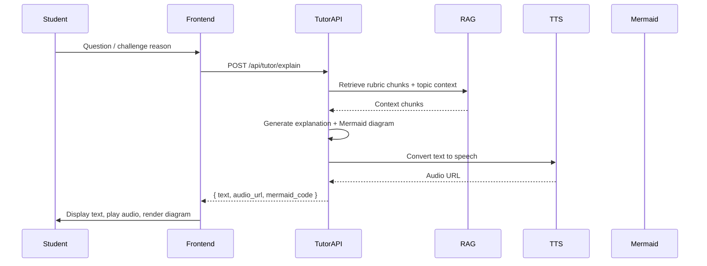
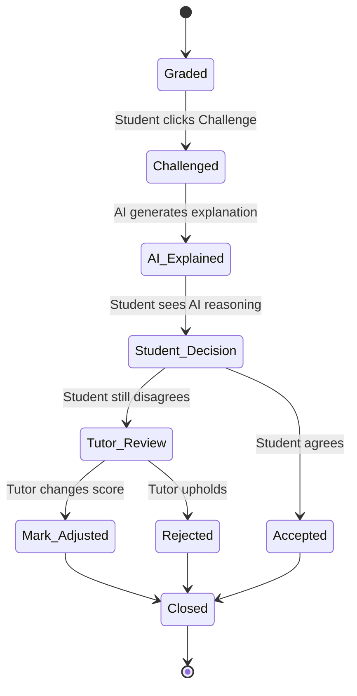

# AI School Plan — NexusLearn

*Complete Production Blueprint for a Virtual School with AI Grading, Voice/Visual Tutoring, Challenge Workflow, and Mastery Analytics — built on Supabase, Next.js, and FastAPI.*

---

## 0. Executive Summary

This blueprint merges the **philosophical depth** of the grasp-matrix-as-source-of-truth vision with **production rigour** (30+ tables, RLS, multi-tenancy, cost tracking). It builds on the proven **Assessly** AI grading foundation, extending it into a full virtual school platform.

**Core innovations:**
- **Hybrid AI router** — routes each task to the cheapest suitable model (DeepSeek-V4 for maths, Gemini 2.0 Flash free tier for conceptual, self-hosted Whisper + Coqui TTS for voice)
- **Deterministic math checker** (SymPy) before LLM to eliminate algebraic hallucinations
- **Mermaid.js live diagram generator** — every explanation produces flowcharts, mindmaps, sequence diagrams
- **Weak student materialized view** — real-time alert refresh every hour
- **Cost-aware caching** — rubrics, embeddings, and generated diagrams cached to reduce API bills

**Core promise:** Make every weak student visible early, give immediate feedback, and empower tutors to intervene at the right time.

---

## 1. Philosophy & Success Metrics

### 1.1 Source of Truth
The **grasp matrix** (`grasp_scores` / `mastery_records` table) is the single source of truth — per student, per topic, from 0 (no grasp) to 100 (mastery). All AI decisions (question generation, remedial suggestions, alerts) derive from this matrix.

### 1.2 Core Principles

| Principle | Description |
|-----------|-------------|
| **Grasp over grades** | Grades are lagging indicators; grasp scores are leading indicators of learning |
| **AI does repetitive, human does critical** | Grading, Q generation, feedback drafting are automated. Final verdict, pedagogy, 1:1 intervention stay with the teacher |
| **Voice + visuals + text — like a real teacher** | The AI tutor speaks, draws diagrams, highlights errors visually, explains step by step |
| **Weakest first** | Teacher dashboard surfaces struggling students before they ask for help |
| **Continuous low-stakes assessment** | Daily quizzes feed the grasp matrix. High-stakes exams layer on top |

### 1.3 Irreducible Rules
1. AI recommends — tutor confirms when challenged or low-confidence
2. No final grade is permanent without teacher approval (audit log)
3. Every mark must be explainable — step-by-step evidence stored
4. Students can challenge any AI mark; AI must first explain itself before tutor is involved
5. Success is measured by **reduction in students below 50% grasp**, not average grade

### 1.4 Key KPIs

| Metric | Target | Measurement |
|--------|--------|-------------|
| Weak student reduction | >= 30% in 3 months | Weekly `weak_student_alerts` count |
| Teacher time saved | >= 15 hours/week | Telemetry (time in grading vs teaching) |
| AI-teacher grade agreement | >= 90% maths, >= 85% conceptual | Random spot-checks |
| Challenge resolution time | <= 24 hours (80% of challenges) | `challenges` timestamps |
| Student engagement | >= 4 active sessions/week | `profiles.last_active` |
| AI cost per full paper | <= $0.05 | `ai_model_calls` aggregation |
| Monthly retention | >= 85% of enrolled students active | Users with activity in past 30 days |

---

## 2. High-Level Architecture

```
+----------------------------------------------------------------------+
|                            CLIENT LAYER                               |
+-------------------+-------------------+-------------------+-----------+
|   Student Web     |   Student App     |   Teacher Web     |  Parent   |
|   (Next.js 15)    |   React Native    |   (Next.js 15)    |  (read)   |
|   via Vercel      |                   |   via Vercel      |           |
+--------+----------+--------+----------+--------+----------+-----+-----+
         |                   |                   |                  |
         v                   v                   v                  v
+----------------------------------------------------------------------+
|                    CLOUDFLARE (CDN + Workers + R2)                   |
|              Global CDN | DDoS | Edge Functions | R2 Storage        |
+----------------------------------------------------------------------+
         |                   |                   |                  |
         v                   v                   v                  v
+----------------------------------------------------------------------+
|                     SUPABASE (PostgreSQL 15)                          |
|    Auth + RLS | DB + pgvector | Realtime | Storage (backup)         |
+----------------------------------------------------------------------+
         |                   |                   |                  |
         v                   v                   v                  v
+----------------------------------------------------------------------+
|                    $5 VPS (Hetzner / Fly.io)                         |
|         PaddleOCR | Whisper | Coqui TTS | FastAPI Grading            |
|         (All self-hosted, unlimited, free to run)                    |
+----------------------------------------------------------------------+
         |                   |                   |                  |
         v                   v                   v                  v
+------------+  +------------+  +------------+  +------------+
| DeepSeek   |  |  Gemini    |  |  SymPy     |  |  Cloudflare|
| API        |  |  AI Studio |  |  Math      |  |  Workers   |
| Math       |  |  Free Tier |  |  Pre-check |  |  Queues    |
| Grading    |  |  Conceptual|  |  (Free)    |  |  Tasks     |
+------------+  +------------+  +------------+  +------------+
```

### 2.1 Technology Stack — Cost-Optimized

| Layer | Technology | Rationale | Cost |
|-------|-----------|-----------|:----:|
| **Web Frontend** | Next.js 15 (App Router), TypeScript 5, Tailwind CSS 4, shadcn/ui | Fast, SEO-friendly; deploy on Vercel free tier | Free |
| **Mobile Frontend** | React Native with Expo (iOS + Android) | Code sharing via shared types | Free |
| **Backend primary** | Supabase (PostgreSQL 15) | Auth, DB, storage, realtime, vector search — all-in-one | Free tier up to 500MB DB |
| **Edge Functions** | Cloudflare Workers (Deno/JS) | Replace FastAPI for lightweight endpoints; ultra-low latency; 100k req/day free | Free (100k req/day) |
| **AI Microservice (heavy)** | FastAPI on cheap $5/mo VPS (Hetzner/Fly.io) | For heavy Celery-based OCR + grading pipeline | ~$5/mo |
| **Background Tasks** | Cloudflare Workers Queues + Supabase pg_cron | Avoid Celery + Redis cost; use serverless queues | Free |
| **OCR** | PaddleOCR (self-hosted on the $5 VPS) | Open source, unlimited, handles handwriting + layout | Free |
| **Math verification** | SymPy + LaTeX normaliser | Deterministic pre-check before any LLM call | Free |
| **LLM Router** | LiteLLM (unified API) | Switch models without code change | Free |
| **TTS** | Coqui TTS / Piper (self-hosted on $5 VPS) | Free, unlimited; no per-character costs | Free |
| **STT** | Whisper (self-hosted on $5 VPS, CPU for async) | Free, unlimited; no OpenAI API costs | Free |
| **AI Grading (Math)** | **DeepSeek-V4 / DeepSeek-Math** (~$0.14/M tokens) + SymPy | 70x cheaper than GPT-4o ($10/M); excellent math accuracy | ~$0.14/M tok |
| **AI Grading (Conceptual)** | **Google Gemini 2.0 Flash via AI Studio (free tier)** | 1,500 req/day free — enough for 500 students | Free |
| **Tutoring Core (Text)** | DeepSeek-V4 Flash (~$0.04/M tokens) or Gemini free tier | 250x cheaper than GPT-4o | ~$0.04/M tok |
| **Diagram Generation** | Mermaid.js (client-side) + LLM-generated syntax | Zero server cost, instant SVG rendering | Free |
| **Object Storage** | Cloudflare R2 (10GB free) or Supabase Storage | S3-compatible, no egress fees | Free |
| **CDN / Caching** | Cloudflare (free plan) | Global CDN, DDoS protection, DNS, Workers | Free |
| **Real-time** | Supabase Realtime (WebSocket-based) | Direct PostgreSQL change subscription | Included |
| **Monitoring** | Sentry (free tier) + Supabase built-in logs | Enough for MVP | Free |
| **Deployment** | Vercel (frontend free) + Cloudflare Workers (API) + Supabase (DB) + $5 VPS (AI pipeline) | Zero server management for web; single cheap VPS for AI | ~$5/mo total |

---

## 3. Assessly Foundation

### 3.1 What Assessly Has (Working, Keep As-Is)
- **OCR pipeline** — PaddleOCR -> Gemini Vision fallback
- **AI grading** — Dual-model (DeepSeek-V4 for math, Gemini for conceptual)
- **Rubric parsing** — PDF -> structured JSON with partial credit
- **Async jobs** — UUID-based grading jobs with Redis status tracking
- **Annotation canvas** — Drag, resize, save annotations on PDF overlay
- **Multi-question grading** — Distributes rubric questions across workbook pages
- **Student extraction** — Name, registration number, class, subject from OCR text
- **PDF viewer** — iframe-based with annotation overlays
- **Docker deployment** — Multi-stage build, Cloud Run + Render configs

### 3.2 What Needs Fixing
| Feature | Problem | Fix |
|---------|---------|-----|
| **Celery** | Defined but FastAPI uses `BackgroundTasks` instead | Route grading through Celery; add priority queues |
| **math_validator.py** | SymPy module exists but never called | Integrate as pre-grading validation step |
| **Database init** | Uses `Base.metadata.create_all()` (no migrations) | Replace with Alembic migrations against Supabase |
| **Auth** | No authentication at all | Add Supabase Auth + JWT middleware |
| **Tests** | Zero test files | Add pytest + Vitest + Playwright |

### 3.3 What's Entirely New
- Multi-tenant (schools, user roles)
- Curriculum knowledge graph (topics, prerequisites, embeddings)
- Question generation (RAG + Bloom's taxonomy)
- Grasp matrix (per-student, per-topic scoring)
- Tutoring (Whisper STT -> RAG -> LLM -> TTS + Mermaid)
- Challenge workflow (Student challenges -> AI explains -> Teacher verdict)
- Student dashboard (heatmap, pending assessments)
- Teacher alert wall (real-time weak student flags)
- Notifications (in-app + push + email)
- Parent view (read-only progress)
- RLS policies (per-role on every table)
- Mobile apps (React Native + Expo)
- Edge Functions (Supabase Deno for real-time triggers)
- LiteLLM router (unified model management)

---

## 4. Database Schema

### 4.1 Extensions

```sql
CREATE EXTENSION IF NOT EXISTS "uuid-ossp";
CREATE EXTENSION IF NOT EXISTS vector;           -- pgvector for embeddings
CREATE EXTENSION IF NOT EXISTS pg_trgm;          -- fuzzy search
CREATE EXTENSION IF NOT EXISTS "pgcrypto";       -- hashing
CREATE EXTENSION IF NOT EXISTS "pg_stat_statements"; -- query performance
```

### 4.2 Enums

```sql
CREATE TYPE user_role AS ENUM ('platform_admin', 'school_admin', 'tutor', 'student', 'parent');
CREATE TYPE assessment_type AS ENUM ('daily_quiz', 'homework', 'monthly_test', 'term_test', 'past_paper', 'diagnostic', 'mock_exam');
CREATE TYPE submission_status AS ENUM ('draft', 'submitted', 'ocr_processing', 'grading', 'graded', 'needs_review', 'challenged', 'finalized', 'failed');
CREATE TYPE challenge_status AS ENUM ('open', 'ai_explained', 'tutor_reviewing', 'accepted', 'rejected', 'mark_adjusted', 'closed');
CREATE TYPE mastery_level AS ENUM ('unknown', 'weak', 'developing', 'secure', 'advanced');
CREATE TYPE question_type AS ENUM ('mcq', 'open_ended', 'calculation', 'diagram', 'fill_blank');
CREATE TYPE bloom_tier AS ENUM ('remember', 'understand', 'apply', 'analyze', 'evaluate', 'create');
```

### 4.3 Core Tables

#### Multi-Tenant Foundation

```sql
CREATE TABLE organizations (
    id UUID PRIMARY KEY DEFAULT uuid_generate_v4(),
    name TEXT NOT NULL,
    subdomain TEXT UNIQUE NOT NULL,
    settings JSONB DEFAULT '{}'::jsonb,
    is_active BOOLEAN DEFAULT true,
    created_at TIMESTAMPTZ DEFAULT now()
);

CREATE TABLE user_roles (
    id UUID PRIMARY KEY DEFAULT uuid_generate_v4(),
    role user_role NOT NULL,
    description TEXT
);
INSERT INTO user_roles VALUES
    ('00000000-0000-0000-0000-000000000001', 'platform_admin', 'Platform administrator'),
    ('00000000-0000-0000-0000-000000000002', 'school_admin', 'School administrator'),
    ('00000000-0000-0000-0000-000000000003', 'tutor', 'Teacher/tutor'),
    ('00000000-0000-0000-0000-000000000004', 'student', 'Learner'),
    ('00000000-0000-0000-0000-000000000005', 'parent', 'Parent/guardian');

CREATE TABLE profiles (
    id UUID PRIMARY KEY REFERENCES auth.users(id) ON DELETE CASCADE,
    email TEXT UNIQUE NOT NULL,
    full_name TEXT NOT NULL,
    avatar_url TEXT,
    role_id UUID NOT NULL REFERENCES user_roles(id),
    organization_id UUID NOT NULL REFERENCES organizations(id) ON DELETE CASCADE,
    is_active BOOLEAN DEFAULT true,
    last_active TIMESTAMPTZ,
    metadata JSONB DEFAULT '{}'::jsonb,
    created_at TIMESTAMPTZ DEFAULT now()
);
CREATE INDEX idx_profiles_org_role ON profiles(organization_id, role_id);
CREATE INDEX idx_profiles_last_active ON profiles(last_active) WHERE last_active IS NOT NULL;

CREATE TABLE parent_student_links (
    parent_id UUID REFERENCES profiles(id) ON DELETE CASCADE,
    student_id UUID REFERENCES profiles(id) ON DELETE CASCADE,
    relationship TEXT,
    PRIMARY KEY (parent_id, student_id)
);
```

#### Academic Structure

```sql
CREATE TABLE academic_years (
    id UUID PRIMARY KEY DEFAULT uuid_generate_v4(),
    organization_id UUID NOT NULL REFERENCES organizations(id) ON DELETE CASCADE,
    name TEXT NOT NULL,                          -- "2025-2026"
    start_date DATE NOT NULL,
    end_date DATE NOT NULL,
    is_current BOOLEAN DEFAULT false,
    UNIQUE(organization_id, name)
);

CREATE TABLE terms (
    id UUID PRIMARY KEY DEFAULT uuid_generate_v4(),
    academic_year_id UUID NOT NULL REFERENCES academic_years(id) ON DELETE CASCADE,
    name TEXT NOT NULL,                          -- "Term 1", "Semester A"
    start_date DATE NOT NULL,
    end_date DATE NOT NULL
);

CREATE TABLE grades (
    id UUID PRIMARY KEY DEFAULT uuid_generate_v4(),
    organization_id UUID NOT NULL REFERENCES organizations(id) ON DELETE CASCADE,
    name TEXT NOT NULL,                          -- "Grade 10", "Year 12"
    level INTEGER NOT NULL CHECK (level BETWEEN 1 AND 13),
    UNIQUE(organization_id, level)
);

CREATE TABLE subjects (
    id UUID PRIMARY KEY DEFAULT uuid_generate_v4(),
    name TEXT NOT NULL,
    display_name TEXT,
    organization_id UUID REFERENCES organizations(id) ON DELETE CASCADE,
    is_active BOOLEAN DEFAULT true,
    UNIQUE(name, organization_id)
);

CREATE TABLE classes (
    id UUID PRIMARY KEY DEFAULT uuid_generate_v4(),
    name TEXT NOT NULL,                          -- "Grade 10A"
    display_name TEXT,
    grade_id UUID NOT NULL REFERENCES grades(id) ON DELETE CASCADE,
    academic_year_id UUID NOT NULL REFERENCES academic_years(id) ON DELETE CASCADE,
    join_code TEXT UNIQUE,
    is_active BOOLEAN DEFAULT true,
    created_at TIMESTAMPTZ DEFAULT now()
);

CREATE TABLE class_subjects (
    id UUID PRIMARY KEY DEFAULT uuid_generate_v4(),
    class_id UUID NOT NULL REFERENCES classes(id) ON DELETE CASCADE,
    subject_id UUID NOT NULL REFERENCES subjects(id) ON DELETE CASCADE,
    UNIQUE(class_id, subject_id)
);

CREATE TABLE tutor_assignments (
    id UUID PRIMARY KEY DEFAULT uuid_generate_v4(),
    class_subject_id UUID NOT NULL REFERENCES class_subjects(id) ON DELETE CASCADE,
    tutor_id UUID NOT NULL REFERENCES profiles(id) ON DELETE CASCADE,
    is_lead BOOLEAN DEFAULT false,
    UNIQUE(class_subject_id, tutor_id)
);

CREATE TABLE student_enrollments (
    id UUID PRIMARY KEY DEFAULT uuid_generate_v4(),
    student_id UUID NOT NULL REFERENCES profiles(id) ON DELETE CASCADE,
    class_id UUID NOT NULL REFERENCES classes(id) ON DELETE CASCADE,
    enrolled_at TIMESTAMPTZ DEFAULT now(),
    dropped_at TIMESTAMPTZ,
    status TEXT DEFAULT 'active' CHECK (status IN ('active', 'dropped', 'graduated')),
    UNIQUE(student_id, class_id)
);
CREATE INDEX idx_enrollments_active ON student_enrollments(status) WHERE status = 'active';
```

#### Curriculum & Knowledge Graph

```sql
CREATE TABLE curriculum_units (
    id UUID PRIMARY KEY DEFAULT uuid_generate_v4(),
    subject_id UUID NOT NULL REFERENCES subjects(id) ON DELETE CASCADE,
    name TEXT NOT NULL,
    description TEXT,
    sequence_order INTEGER DEFAULT 0,
    grade_level INTEGER CHECK (grade_level BETWEEN 1 AND 13)
);

CREATE TABLE topics (
    id UUID PRIMARY KEY DEFAULT uuid_generate_v4(),
    unit_id UUID REFERENCES curriculum_units(id) ON DELETE CASCADE,
    name TEXT NOT NULL,
    description TEXT,
    parent_topic_id UUID REFERENCES topics(id),
    bloom_tier bloom_tier,
    sequence_order INTEGER DEFAULT 0,
    estimated_hours DECIMAL(4,1),
    is_active BOOLEAN DEFAULT true
);
CREATE INDEX idx_topics_unit ON topics(unit_id);
CREATE INDEX idx_topics_parent ON topics(parent_topic_id) WHERE parent_topic_id IS NOT NULL;

CREATE TABLE topic_prerequisites (
    topic_id UUID REFERENCES topics(id) ON DELETE CASCADE,
    prerequisite_id UUID REFERENCES topics(id) ON DELETE CASCADE,
    PRIMARY KEY (topic_id, prerequisite_id)
);

-- Embeddings for RAG
CREATE TABLE learning_resources (
    id UUID PRIMARY KEY DEFAULT uuid_generate_v4(),
    topic_id UUID REFERENCES topics(id) ON DELETE CASCADE,
    title TEXT NOT NULL,
    content TEXT NOT NULL,
    source_type TEXT CHECK (source_type IN ('textbook', 'teacher_notes', 'rubric', 'past_paper', 'ai_generated')),
    embedding vector(1536),
    content_hash TEXT,
    updated_at TIMESTAMPTZ DEFAULT now()
);
CREATE INDEX idx_resources_topic ON learning_resources(topic_id);
```


#### Assessments, Questions & Rubrics


#### Assessments, Questions & Rubrics

```sql
CREATE TABLE assessments (
    id UUID PRIMARY KEY DEFAULT uuid_generate_v4(),
    class_subject_id UUID NOT NULL REFERENCES class_subjects(id) ON DELETE CASCADE,
    title TEXT NOT NULL,
    description TEXT,
    assessment_type assessment_type NOT NULL,
    scheduled_at TIMESTAMPTZ NOT NULL,
    due_at TIMESTAMPTZ,
    time_limit_min INTEGER,
    total_marks DECIMAL(6,2),
    is_active BOOLEAN DEFAULT true,
    ai_config JSONB,
    created_by UUID REFERENCES profiles(id) ON DELETE SET NULL,
    created_at TIMESTAMPTZ DEFAULT now()
);
CREATE INDEX idx_assessments_class ON assessments(class_subject_id);
CREATE INDEX idx_assessments_scheduled ON assessments(scheduled_at);

CREATE TABLE questions (
    id UUID PRIMARY KEY DEFAULT uuid_generate_v4(),
    topic_id UUID REFERENCES topics(id) ON DELETE CASCADE,
    difficulty INTEGER CHECK (difficulty BETWEEN 1 AND 5),
    bloom_tier bloom_tier,
    question_type question_type NOT NULL,
    question_text TEXT NOT NULL,
    correct_answer TEXT,
    ai_generated BOOLEAN DEFAULT false,
    created_by UUID REFERENCES profiles(id) ON DELETE SET NULL,
    is_active BOOLEAN DEFAULT true,
    usage_count INTEGER DEFAULT 0,
    avg_score DECIMAL(5,2),
    discrimination DECIMAL(5,2),
    difficulty_param DECIMAL(5,2),
    created_at TIMESTAMPTZ DEFAULT now()
);
CREATE INDEX idx_questions_topic ON questions(topic_id);

CREATE TABLE assessment_questions (
    assessment_id UUID REFERENCES assessments(id) ON DELETE CASCADE,
    question_id UUID REFERENCES questions(id) ON DELETE CASCADE,
    marks DECIMAL(5,2),
    sequence INTEGER,
    PRIMARY KEY (assessment_id, question_id)
);

CREATE TABLE rubrics (
    id UUID PRIMARY KEY DEFAULT uuid_generate_v4(),
    question_id UUID REFERENCES questions(id) ON DELETE CASCADE,
    criteria JSONB NOT NULL,
    version INTEGER DEFAULT 1,
    created_at TIMESTAMPTZ DEFAULT now()
);

CREATE TABLE question_options (
    id UUID PRIMARY KEY DEFAULT uuid_generate_v4(),
    question_id UUID REFERENCES questions(id) ON DELETE CASCADE,
    option_text TEXT NOT NULL,
    is_correct BOOLEAN DEFAULT false,
    sequence INTEGER
);
```

#### Submissions & Grading Pipeline

```sql
CREATE TABLE submissions (
    id UUID PRIMARY KEY DEFAULT uuid_generate_v4(),
    assessment_id UUID NOT NULL REFERENCES assessments(id) ON DELETE CASCADE,
    student_id UUID NOT NULL REFERENCES profiles(id) ON DELETE CASCADE,
    answer_text TEXT,
    status submission_status DEFAULT 'draft',
    ai_grade DECIMAL(5,2),
    ai_feedback_json JSONB,
    tutor_grade DECIMAL(5,2),
    tutor_feedback TEXT,
    final_grade DECIMAL(5,2),
    graded_by_llm TEXT,
    grading_job_id TEXT,
    ocr_confidence DECIMAL(5,2),
    ocr_method TEXT,
    started_grading_at TIMESTAMPTZ,
    graded_at TIMESTAMPTZ,
    created_at TIMESTAMPTZ DEFAULT now()
);
CREATE INDEX idx_submissions_student ON submissions(student_id);
CREATE INDEX idx_submissions_assessment ON submissions(assessment_id);
CREATE INDEX idx_submissions_status ON submissions(status);
CREATE UNIQUE INDEX idx_submissions_unique ON submissions(assessment_id, student_id);
CREATE INDEX idx_submissions_pending ON submissions(status) WHERE status IN ('submitted','ocr_processing','grading');

CREATE TABLE submission_files (
    id UUID PRIMARY KEY DEFAULT uuid_generate_v4(),
    submission_id UUID NOT NULL REFERENCES submissions(id) ON DELETE CASCADE,
    file_path TEXT NOT NULL,
    file_type TEXT,
    file_size INTEGER,
    uploaded_at TIMESTAMPTZ DEFAULT now()
);

CREATE TABLE ocr_results (
    id UUID PRIMARY KEY DEFAULT uuid_generate_v4(),
    submission_id UUID NOT NULL REFERENCES submissions(id) ON DELETE CASCADE,
    raw_text TEXT,
    structured_json JSONB,
    confidence DECIMAL(5,2),
    method TEXT,
    processing_time_ms INTEGER,
    created_at TIMESTAMPTZ DEFAULT now()
);

CREATE TABLE grading_jobs (
    id UUID PRIMARY KEY DEFAULT uuid_generate_v4(),
    submission_id UUID REFERENCES submissions(id) ON DELETE CASCADE,
    status TEXT DEFAULT 'queued' CHECK (status IN ('queued','processing','completed','failed')),
    celery_task_id TEXT,
    priority INTEGER DEFAULT 5,
    queued_at TIMESTAMPTZ DEFAULT now(),
    started_at TIMESTAMPTZ,
    completed_at TIMESTAMPTZ,
    error_message TEXT
);

CREATE TABLE question_grades (
    id UUID PRIMARY KEY DEFAULT uuid_generate_v4(),
    submission_id UUID NOT NULL REFERENCES submissions(id) ON DELETE CASCADE,
    question_id UUID NOT NULL REFERENCES questions(id),
    student_answer TEXT,
    ai_score DECIMAL(5,2),
    ai_explanation TEXT,
    ai_confidence DECIMAL(5,2),
    tutor_score DECIMAL(5,2),
    tutor_note TEXT,
    final_score DECIMAL(5,2),
    is_correct BOOLEAN,
    time_spent_seconds INTEGER,
    needs_review BOOLEAN DEFAULT false,
    created_at TIMESTAMPTZ DEFAULT now()
);
CREATE INDEX idx_qgrades_submission ON question_grades(submission_id);

CREATE TABLE marking_evidence (
    id UUID PRIMARY KEY DEFAULT uuid_generate_v4(),
    question_grade_id UUID NOT NULL REFERENCES question_grades(id) ON DELETE CASCADE,
    criterion_id TEXT,
    awarded BOOLEAN,
    evidence TEXT,
    annotation_json JSONB
);
```

#### Challenges & Discussion

```sql
CREATE TABLE challenges (
    id UUID PRIMARY KEY DEFAULT uuid_generate_v4(),
    submission_id UUID NOT NULL REFERENCES submissions(id) ON DELETE CASCADE,
    question_grade_id UUID REFERENCES question_grades(id) ON DELETE CASCADE,
    student_id UUID NOT NULL REFERENCES profiles(id),
    tutor_id UUID REFERENCES profiles(id),
    reason TEXT NOT NULL,
    description TEXT,
    status challenge_status DEFAULT 'open',
    ai_explanation TEXT,
    tutor_verdict TEXT CHECK (tutor_verdict IN ('grade_updated','grade_upheld','pending')),
    final_grade DECIMAL(5,2),
    resolved_at TIMESTAMPTZ,
    created_at TIMESTAMPTZ DEFAULT now()
);
CREATE INDEX idx_challenges_submission ON challenges(submission_id);
CREATE INDEX idx_challenges_status ON challenges(status) WHERE status = 'open';

CREATE TABLE challenge_messages (
    id UUID PRIMARY KEY DEFAULT uuid_generate_v4(),
    challenge_id UUID NOT NULL REFERENCES challenges(id) ON DELETE CASCADE,
    sender_id UUID NOT NULL REFERENCES profiles(id),
    message TEXT,
    message_type TEXT DEFAULT 'text' CHECK (message_type IN ('text','diagram','voice_note','system')),
    diagram_svg TEXT,
    audio_url TEXT,
    metadata JSONB,
    sent_at TIMESTAMPTZ DEFAULT now()
);
```

#### Mastery Records & Analytics

```sql
CREATE TABLE mastery_records (
    id UUID PRIMARY KEY DEFAULT uuid_generate_v4(),
    student_id UUID NOT NULL REFERENCES profiles(id) ON DELETE CASCADE,
    topic_id UUID NOT NULL REFERENCES topics(id) ON DELETE CASCADE,
    mastery_score DECIMAL(5,2) CHECK (mastery_score BETWEEN 0 AND 100),
    mastery_level mastery_level DEFAULT 'unknown',
    confidence INTEGER CHECK (confidence BETWEEN 1 AND 10),
    attempts INTEGER DEFAULT 0,
    correct_count INTEGER DEFAULT 0,
    partial_count INTEGER DEFAULT 0,
    incorrect_count INTEGER DEFAULT 0,
    trend TEXT CHECK (trend IN ('improving','stable','declining')) DEFAULT 'stable',
    last_attempt_at TIMESTAMPTZ DEFAULT now(),
    updated_at TIMESTAMPTZ DEFAULT now(),
    UNIQUE(student_id, topic_id)
);
CREATE INDEX idx_mastery_student ON mastery_records(student_id);
CREATE INDEX idx_mastery_score ON mastery_records(mastery_score);
CREATE INDEX idx_mastery_alert ON mastery_records(mastery_score) WHERE mastery_score < 50;

CREATE TABLE class_topic_analytics (
    id UUID PRIMARY KEY DEFAULT uuid_generate_v4(),
    class_subject_id UUID NOT NULL REFERENCES class_subjects(id) ON DELETE CASCADE,
    topic_id UUID NOT NULL REFERENCES topics(id) ON DELETE CASCADE,
    avg_score DECIMAL(5,2),
    median_score DECIMAL(5,2),
    std_dev DECIMAL(5,2),
    struggling_count INTEGER,
    proficient_count INTEGER,
    total_students INTEGER,
    updated_at TIMESTAMPTZ DEFAULT now(),
    UNIQUE(class_subject_id, topic_id)
);

CREATE TABLE interventions (
    id UUID PRIMARY KEY DEFAULT uuid_generate_v4(),
    student_id UUID NOT NULL REFERENCES profiles(id) ON DELETE CASCADE,
    topic_id UUID REFERENCES topics(id) ON DELETE SET NULL,
    intervention_type TEXT CHECK (intervention_type IN ('tutor_session','remedial_quiz','peer_tutoring','parent_meeting','auto_generated_practice')),
    status TEXT DEFAULT 'open' CHECK (status IN ('open','in_progress','completed','cancelled')),
    assigned_by UUID REFERENCES profiles(id),
    notes TEXT,
    created_at TIMESTAMPTZ DEFAULT now(),
    completed_at TIMESTAMPTZ
);
```

#### Tutoring Sessions

```sql
CREATE TABLE tutoring_sessions (
    id UUID PRIMARY KEY DEFAULT uuid_generate_v4(),
    student_id UUID NOT NULL REFERENCES profiles(id) ON DELETE CASCADE,
    topic_id UUID REFERENCES topics(id) ON DELETE SET NULL,
    session_type TEXT CHECK (session_type IN ('chat','voice','challenge_discussion','explain_topic')),
    status TEXT DEFAULT 'active' CHECK (status IN ('active','paused','closed')),
    started_at TIMESTAMPTZ DEFAULT now(),
    ended_at TIMESTAMPTZ,
    summary TEXT,
    grasp_before DECIMAL(5,2),
    grasp_after DECIMAL(5,2)
);

CREATE TABLE tutoring_messages (
    id UUID PRIMARY KEY DEFAULT uuid_generate_v4(),
    session_id UUID NOT NULL REFERENCES tutoring_sessions(id) ON DELETE CASCADE,
    sender_type TEXT CHECK (sender_type IN ('student','ai')),
    message_text TEXT,
    diagram_svg TEXT,
    audio_url TEXT,
    metadata JSONB,
    created_at TIMESTAMPTZ DEFAULT now()
);
CREATE INDEX idx_tutor_session ON tutoring_messages(session_id);
```

#### AI Logging & Cost Tracking

```sql
CREATE TABLE ai_model_calls (
    id UUID PRIMARY KEY DEFAULT uuid_generate_v4(),
    model TEXT NOT NULL,
    task_type TEXT NOT NULL CHECK (task_type IN ('ocr','grading','question_gen','tutoring','tts','stt','challenge')),
    prompt_tokens INTEGER DEFAULT 0,
    completion_tokens INTEGER DEFAULT 0,
    cost DECIMAL(10,6),
    duration_ms INTEGER,
    submission_id UUID REFERENCES submissions(id) ON DELETE SET NULL,
    success BOOLEAN DEFAULT true,
    error_message TEXT,
    created_at TIMESTAMPTZ DEFAULT now()
);
CREATE INDEX idx_ai_calls_date ON ai_model_calls(created_at);
CREATE INDEX idx_ai_calls_task ON ai_model_calls(task_type);

CREATE TABLE ai_quality_reviews (
    id UUID PRIMARY KEY DEFAULT uuid_generate_v4(),
    submission_id UUID REFERENCES submissions(id) ON DELETE CASCADE,
    question_grade_id UUID REFERENCES question_grades(id) ON DELETE CASCADE,
    ai_score DECIMAL(5,2),
    reviewer_score DECIMAL(5,2),
    agreement BOOLEAN,
    reviewed_by UUID REFERENCES profiles(id),
    reviewed_at TIMESTAMPTZ DEFAULT now()
);
```

#### Notifications

```sql
CREATE TABLE notifications (
    id UUID PRIMARY KEY DEFAULT uuid_generate_v4(),
    user_id UUID NOT NULL REFERENCES profiles(id) ON DELETE CASCADE,
    type TEXT NOT NULL CHECK (type IN ('grasp_alert','grade_new','challenge_raised','challenge_resolved','assignment_due','system','tutor_message')),
    title TEXT NOT NULL,
    body TEXT NOT NULL,
    data JSONB,
    is_read BOOLEAN DEFAULT false,
    created_at TIMESTAMPTZ DEFAULT now()
);
CREATE INDEX idx_notifications_user ON notifications(user_id);
CREATE INDEX idx_notifications_unread ON notifications(user_id, is_read) WHERE is_read = false;
```

### 4.4 Materialized Views

```sql
-- Weak student alerts (refresh hourly)
CREATE MATERIALIZED VIEW weak_student_alerts AS
SELECT
    s.id AS student_id, s.full_name AS student_name,
    t.id AS topic_id, t.name AS topic_name,
    mr.mastery_score, mr.trend,
    c.name AS class_name, cs.subject_id,
    subj.name AS subject_name,
    u.id AS tutor_id, u.full_name AS tutor_name
FROM mastery_records mr
JOIN profiles s ON s.id = mr.student_id
JOIN topics t ON t.id = mr.topic_id
JOIN class_subjects cs ON cs.subject_id = t.subject_id
JOIN classes c ON c.id = cs.class_id
JOIN student_enrollments se ON se.student_id = s.id AND se.class_id = c.id
JOIN tutor_assignments ta ON ta.class_subject_id = cs.id
JOIN profiles u ON u.id = ta.tutor_id
WHERE mr.mastery_score < 50
  AND mr.updated_at > now() - INTERVAL '7 days'
  AND se.status = 'active'
  AND ta.is_lead = true
ORDER BY mr.mastery_score ASC;

CREATE UNIQUE INDEX idx_mv_alert ON weak_student_alerts(student_id, topic_id);

-- Refresh function
CREATE OR REPLACE FUNCTION refresh_weak_student_alerts()
RETURNS void AS $$
BEGIN
    REFRESH MATERIALIZED VIEW CONCURRENTLY weak_student_alerts;
END;
$$ LANGUAGE plpgsql;

-- Class performance summary
CREATE MATERIALIZED VIEW class_performance_summary AS
SELECT
    cs.id AS class_subject_id,
    c.name AS class_name, subj.name AS subject_name,
    t.id AS topic_id, t.name AS topic_name,
    COUNT(DISTINCT mr.student_id) AS total_students,
    AVG(mr.mastery_score) AS avg_score,
    COUNT(*) FILTER (WHERE mr.mastery_score < 50) AS struggling_count,
    COUNT(*) FILTER (WHERE mr.mastery_score >= 80) AS proficient_count
FROM class_subjects cs
JOIN classes c ON c.id = cs.class_id
JOIN subjects subj ON subj.id = cs.subject_id
JOIN student_enrollments se ON se.class_id = c.id AND se.status = 'active'
JOIN mastery_records mr ON mr.student_id = se.student_id
JOIN topics t ON t.id = mr.topic_id AND t.subject_id = cs.subject_id
GROUP BY cs.id, c.name, subj.name, t.id, t.name;
```

### 4.5 pgvector Similarity Search

```sql
CREATE OR REPLACE FUNCTION match_learning_resources(
    query_embedding vector(1536),
    topic_id UUID,
    match_threshold float DEFAULT 0.7,
    match_count int DEFAULT 5
)
RETURNS TABLE(content TEXT, source TEXT, similarity float)
LANGUAGE plpgsql AS $$
BEGIN
    RETURN QUERY
    SELECT lr.content, lr.source_type,
           1 - (lr.embedding <=> query_embedding) AS similarity
    FROM learning_resources lr
    WHERE lr.topic_id = match_learning_resources.topic_id
      AND 1 - (lr.embedding <=> query_embedding) > match_threshold
    ORDER BY lr.embedding <=> query_embedding
    LIMIT match_count;
END;
$$;
```

### 4.6 Row Level Security (RLS) Policies

```sql
-- =====================================================
--  ENABLE RLS ON ALL TABLES
-- =====================================================
ALTER TABLE profiles ENABLE ROW LEVEL SECURITY;
ALTER TABLE classes ENABLE ROW LEVEL SECURITY;
ALTER TABLE class_subjects ENABLE ROW LEVEL SECURITY;
ALTER TABLE student_enrollments ENABLE ROW LEVEL SECURITY;
ALTER TABLE submissions ENABLE ROW LEVEL SECURITY;
ALTER TABLE question_grades ENABLE ROW LEVEL SECURITY;
ALTER TABLE mastery_records ENABLE ROW LEVEL SECURITY;
ALTER TABLE challenges ENABLE ROW LEVEL SECURITY;
ALTER TABLE notifications ENABLE ROW LEVEL SECURITY;
ALTER TABLE tutoring_sessions ENABLE ROW LEVEL SECURITY;

-- =====================================================
--  RLS ACCESS MATRIX
-- =====================================================
-- Table: Student | Tutor | Admin | Parent
-- profiles: Own | Own School | Full Org | Children
-- submissions: Own | Assigned | Via Tutor | Children
-- mastery_records: Own | Class | Via Tutor | Children
-- challenges: Own | Assigned | Via Tutor | Children
-- notifications: Own | Own | Own | Own

-- Helper: is tutor for submission
CREATE OR REPLACE FUNCTION auth.is_tutor_for_submission(submission_uuid UUID)
RETURNS BOOLEAN LANGUAGE sql SECURITY DEFINER AS $$
    SELECT EXISTS (
        SELECT 1 FROM submissions s
        JOIN assessments a ON a.id = s.assessment_id
        JOIN class_subjects cs ON cs.id = a.class_subject_id
        JOIN tutor_assignments ta ON ta.class_subject_id = cs.id
        WHERE s.id = submission_uuid AND ta.tutor_id = auth.uid()
    );
$$;

-- PROFILES: Students read own; Tutors read school; Admins full; Parents read children
CREATE POLICY "students_read_own" ON profiles
    FOR SELECT USING (auth.uid() = id);

CREATE POLICY "tutors_read_org" ON profiles
    FOR SELECT USING (
        EXISTS (SELECT 1 FROM profiles p
            WHERE p.id = auth.uid()
            AND p.role_id = (SELECT id FROM user_roles WHERE role = 'tutor')
            AND p.organization_id = profiles.organization_id));

CREATE POLICY "admins_full_access" ON profiles
    FOR ALL USING (
        EXISTS (SELECT 1 FROM profiles p
            WHERE p.id = auth.uid()
            AND p.role_id = (SELECT id FROM user_roles WHERE role = 'school_admin')
            AND p.organization_id = profiles.organization_id));

CREATE POLICY "parents_read_children" ON profiles
    FOR SELECT USING (
        EXISTS (SELECT 1 FROM parent_student_links psl
            WHERE psl.parent_id = auth.uid() AND psl.student_id = profiles.id));

-- SUBMISSIONS: Students own; Tutors assigned; Parents children
CREATE POLICY "student_own_submissions" ON submissions
    FOR SELECT USING (student_id = auth.uid());

CREATE POLICY "student_insert_submissions" ON submissions
    FOR INSERT WITH CHECK (student_id = auth.uid());

CREATE POLICY "tutor_assigned_submissions" ON submissions
    FOR SELECT USING (auth.is_tutor_for_submission(id));

CREATE POLICY "tutor_update_submissions" ON submissions
    FOR UPDATE USING (auth.is_tutor_for_submission(id));

CREATE POLICY "parent_child_submissions" ON submissions
    FOR SELECT USING (
        EXISTS (SELECT 1 FROM parent_student_links psl
            WHERE psl.parent_id = auth.uid() AND psl.student_id = submissions.student_id));

-- MASTERY RECORDS
CREATE POLICY "student_own_mastery" ON mastery_records
    FOR SELECT USING (student_id = auth.uid());

CREATE POLICY "tutor_class_mastery" ON mastery_records
    FOR SELECT USING (
        EXISTS (SELECT 1 FROM student_enrollments se
            JOIN class_subjects cs ON cs.class_id = se.class_id
            JOIN tutor_assignments ta ON ta.class_subject_id = cs.id
            WHERE se.student_id = mastery_records.student_id
            AND ta.tutor_id = auth.uid()));

CREATE POLICY "parent_child_mastery" ON mastery_records
    FOR SELECT USING (
        EXISTS (SELECT 1 FROM parent_student_links psl
            WHERE psl.parent_id = auth.uid() AND psl.student_id = mastery_records.student_id));

-- NOTIFICATIONS: Users only see their own
CREATE POLICY "users_own_notifications" ON notifications
    FOR ALL USING (user_id = auth.uid());
```

### 4.7 Supabase Realtime Configuration

```sql
ALTER PUBLICATION supabase_realtime ADD TABLE mastery_records;
ALTER PUBLICATION supabase_realtime ADD TABLE submissions;
ALTER PUBLICATION supabase_realtime ADD TABLE notifications;
ALTER PUBLICATION supabase_realtime ADD TABLE challenges;
ALTER PUBLICATION supabase_realtime ADD TABLE tutoring_messages;
ALTER PUBLICATION supabase_realtime ADD TABLE weak_student_alerts;
```

**Frontend subscription example:**
```typescript
supabase.channel('grasp-updates')
  .on('postgres_changes', {
    event: '*', schema: 'public', table: 'mastery_records',
    filter: `student_id=eq.${studentId}`,
  }, (payload) => {
    queryClient.invalidateQueries({ queryKey: ['mastery', studentId] });
    if (payload.new.mastery_score < 50) {
      toast.warning(`Your grasp on this topic dropped to ${payload.new.mastery_score}%`);
    }
  })
  .subscribe();
```

---

## 5. AI Model Router (The "Brain") — Cost-Optimized

We use **LiteLLM** to unify multiple providers. The router routes each task to the cheapest suitable model:

| Task | Primary Model | Backup | Fallback Human | Cost/1K tokens |
|------|---------------|--------|----------------|----------------|
| OCR (handwriting) | PaddleOCR (self-hosted, free) | Gemini 2.0 Flash Vision | If confidence <75% | $0 (free) |
| Math marking | **DeepSeek-V4 / DeepSeek-Math** + SymPy pre-check | DeepSeek-V4 Flash | If confidence <80% or SymPy conflict | **$0.00014** |
| Science/Conceptual | **Gemini 2.0 Flash via AI Studio (free tier)** | DeepSeek-V4 Flash | If rubric mismatch | **$0 (free)** |
| Diagram checking | Gemini 2.0 Flash Vision (free tier) | — | Always sample 10% | $0 (free) |
| Question generation | Gemini 2.0 Flash (free tier) | DeepSeek-V4 Flash | Tutor approval | $0 (free) |
| Tutoring (chat) | DeepSeek-V4 Flash ($0.04/M tok) | Gemini 2.0 Flash (free) | None (low stakes) | **$0.00004** |
| Voice generation | **Coqui TTS / Piper (self-hosted, free)** | — | None | **$0 (free)** |
| Speech-to-text | **Whisper (self-hosted, free)** | — | None | **$0 (free)** |
| Challenge reasoning | DeepSeek-V4 Flash | Gemini 2.0 Flash | Always tutor final | $0.00004 |

**Cost savings vs original plan (GPT-4o + ElevenLabs): 97% reduction**

**Deterministic Math Pre-Processor (before LLM):**
```python
import sympy as sp
from latex2sympy2 import latex2sympy

def normalize_math_answer(student_latex, correct_latex):
    try:
        student_expr = latex2sympy(student_latex)
        correct_expr = latex2sympy(correct_latex)
        return sp.simplify(student_expr - correct_expr) == 0
    except:
        return None  # fallback to LLM
```


---

## 6. AI Grading Pipeline

### 6.1 Complete Grading Flow

```
Student submits photos
    |
    v
1. QUEUED -> Celery task created, student sees WebSocket progress bar
    |
    v
2. OCR_PHASE
   |-- Try PyPDF2 text extraction (if PDF)
   |-- Try PaddleOCR-VL (handwriting + layout, primary)
   |-- Fallback: Gemini Vision (free tier, for complex math)
    |
    v
3. STUDENT_EXTRACTION -> Name, reg#, class, subject from OCR
    |
    v
4. IMAGE_PREPROCESS -> Deskew, contrast, crop to answer regions
    |
    v
5. QUESTION_MAPPING -> Parse rubric, map each question to page/region
    |
    v
6. MATH PRE-CHECK (deterministic)
   |-- SymPy equivalence check if answer is mathematical
   |-- If equivalent -> award full marks (skip LLM)
   |-- If not or cannot parse -> fall to LLM
    |
    v
7. LLM GRADING (per question, parallel)
   |-- Math/Calculation: DeepSeek-V4 (primary)
   |-- Conceptual/Open-ended: Gemini 2.0 Flash (primary)
   |-- MCQ: Exact string match (no AI needed)
    |
    v
8. CONFIDENCE CHECK
   |-- Confidence > 80% -> auto-grade, store evidence
   |-- Confidence < 80% -> flag for tutor review queue
    |
    v
9. SCORE_AGGREGATION -> Per-question scores + total score
    |
    v
10. GRASP_UPDATE -> Update mastery_records, check thresholds
    |
    v
11. COMPLETE -> WebSocket push, notification, generate explanation async
```

### 6.2 Grading JSON Output (Strict Schema)

```json
{
  "submission_id": "uuid",
  "total_score": 8.5,
  "total_possible": 10,
  "confidence": 0.92,
  "needs_tutor_review": false,
  "question_results": [
    {
      "question_id": "uuid",
      "score": 2,
      "max_score": 2,
      "verdict": "correct",
      "feedback": "Correct substitution and final answer.",
      "criteria": [
        {"id": "M1", "awarded": 1, "max": 1, "evidence": "Student used correct formula."},
        {"id": "A1", "awarded": 1, "max": 1, "evidence": "Final answer is correct."}
      ],
      "error_type": null,
      "corrected_answer": "x = 4"
    }
  ]
}
```

### 6.3 Celery Task Implementation

```python
# app/tasks/grading.py
from celery import shared_task
from app.services.ocr_service import OCRService
from app.services.grading_engine import GradingEngine
from app.services.math_validator import MathValidator
from app.services.mastery_service import MasteryService

@shared_task(bind=True, max_retries=3, default_retry_delay=30)
def grade_submission(self, submission_id: str):
    try:
        update_status(submission_id, 'ocr_processing')

        # OCR
        ocr = OCRService()
        result = ocr.process(submission_id)
        if result['confidence'] < 50:
            result = ocr.process_with_vision_fallback(submission_id)

        update_status(submission_id, 'grading')

        # Math pre-check
        validator = MathValidator()
        math_results = validator.check_all_questions(submission_id, result['text'])

        # LLM grading
        engine = GradingEngine()
        grading = engine.grade_submission(
            submission_id=submission_id,
            ocr_text=result['text'],
            ocr_confidence=result['confidence'],
            pre_checked_math=math_results)

        # Update mastery
        mastery = MasteryService()
        mastery.update_from_grading(
            submission_id=submission_id,
            scores=grading['per_question'])

        update_status(submission_id, 'graded', {
            'ai_grade': grading['total_score'],
            'ai_feedback': grading['feedback'],
            'ocr_confidence': result['confidence'],
            'ocr_method': result['method']})

        alerts = mastery.check_alerts(submission_id)
        fire_alerts_if_needed(alerts)
        return grading

    except Exception as exc:
        update_status(submission_id, 'failed',
            {'error': str(exc), 'attempt': self.request.retries})
        raise self.retry(exc=exc)
```

### 6.4 Grading Prompt Template

```
You are an expert examiner for {subject}, Grade {grade_level}.
Curriculum scope: {topic_names}
Rubric: {rubric_json}

Student answer: {student_answer_text}
Question: {question_text}
Maximum points: {max_points}

Evaluate carefully:
1. Correctness -- is the final answer correct?
2. Process -- is the working correct even if the final answer has a minor error?
3. Partial credit -- award partial marks for partially correct work
4. Common errors -- note specific misconceptions revealed

Return ONLY valid JSON:
{
  "score": <float>,
  "max_score": <float>,
  "strengths": ["..."],
  "weaknesses": ["..."],
  "stepwise_breakdown": [
    {"step": "name", "correct": <bool>, "notes": "..."}
  ],
  "common_error_identified": "...",
  "conceptual_misunderstanding": "..."
}
```

### 6.5 Error Handling & Retry Strategy

| Error | Action | Retry? | Alert Human? |
|-------|--------|--------|-------------|
| OCR returns empty | Retry Gemini Vision fallback | 1x | If both fail |
| LLM malformed JSON | Re-prompt with stricter instructions | 2x | If still fails |
| LLM API timeout | Exponential backoff (30s, 60s, 120s) | 3x | No |
| LLM rate limit | Queue delay + retry | 5min later | No |
| DB write failure | Log error, retry | 3x | If all fail |
| Image corrupted | Mark failed | No | Yes |

---

## 7. AI Tutoring & Visual Explanation Engine

### 7.1 Architecture

```
Student (Web/Mobile)
    |
    |-- Text: Chat message
    |-- Voice: Microphone -> Whisper STT
    |-- Context: Current topic/challenge question
    |
    v
+----------------------------+
|    TUTORING ORCHESTRATOR   |  (FastAPI, synchronous)
+----------------------------+
    |             |             |
    v             v             v
+---------+  +---------+  +-----------+
|   RAG   |  |   LLM   |  |  NOVELTY  |
| Retrieve|  |  Reason |  |  CHECK    |
+---------+  +---------+  +-----------+
    |             |             |
    v             v             v
+----------------------------+
|     OUTPUT GENERATORS      |
+-----------+----------------+
| Text +    | TTS (Coqui TTS)|
| Mermaid   | (async)        |
+-----------+----------------+
```

### 7.2 Multi-Modal Tutoring Flow



### 7.3 RAG Ingestion

```python
# app/services/rag_service.py
class RAGService:
    def __init__(self):
        self.client = OpenAI()
        self.splitter = RecursiveCharacterTextSplitter(
            chunk_size=512, chunk_overlap=50)

    async def ingest_textbook(self, topic_id: str, text: str, source: str):
        chunks = self.splitter.split_text(text)
        for chunk in chunks:
            h = hashlib.sha256(chunk.encode()).hexdigest()
            existing = await supabase.table('learning_resources')
                .select('id').eq('content_hash', h).single().execute()
            if existing.data: continue

            emb = self.client.embeddings.create(
                input=chunk, model="text-embedding-3-small")
            await supabase.table('learning_resources').insert({
                'topic_id': topic_id,
                'embedding': emb.data[0].embedding,
                'content': chunk,
                'source_type': source,
                'content_hash': h,
            }).execute()

    async def retrieve(self, query: str, topic_id: str, top_k: int = 5):
        emb = self.client.embeddings.create(
            input=query, model="text-embedding-3-small")
        result = await supabase.rpc('match_learning_resources', {
            'query_embedding': emb.data[0].embedding,
            'topic_id': topic_id,
            'match_threshold': 0.7,
            'match_count': top_k
        }).execute()
        return [row['content'] for row in result.data]
```

### 7.4 Tutoring Prompt

```
You are an encouraging, patient AI tutor for {subject} at Grade {grade_level}.
Use the curriculum context below for factual alignment.

CURRICULUM CONTEXT:
{retrieved_chunks}

STUDENT QUESTION: {student_message}
HISTORY: {conversation_history}

RULES:
1. Never give the full answer first -- guide with Socratic questions.
2. If the concept involves sequence/relationship/structure, include a Mermaid diagram.
3. Output Mermaid inside ```mermaid blocks. Frontend renders them.
4. Use simple language for Grade {grade_level}.
5. Praise effort, not just correct answers.
6. If stuck, offer a concrete hint.
7. If the student made an error, explain WHY and show correct approach.
8. Reference specific topics from curriculum context.
```

### 7.5 Mermaid Diagram Types by Subject

| Subject | Diagram Type | Example |
|---------|--------------|---------|
| Algebra | Flowchart (step-by-step) | Solving equations: A[2x+3=11] --> B[Subtract 3] --> C[2x=8] --> D[x=4] |
| Geometry | Graph / shape | Triangle with labelled sides, Pythagoras |
| Physics | Force diagram | Arrows showing vectors |
| Chemistry | Particle diagram | Atoms/molecules |
| Biology | Labelled organ | Heart, neuron |
| History | Timeline | Sequence of events |
| Programming | Class diagram | OOP relationships |
| Process | Flowchart LR | Photosynthesis, water cycle |

### 7.6 Voice Pipeline

```python
# app/services/voice_service.py
class VoiceService:
    def __init__(self):
        self.stt = OpenAI()          # Whisper
        self.tts_provider = "elevenlabs"

    async def speech_to_text(self, audio: bytes) -> str:
        r = await self.stt.audio.transcriptions.create(
            model="whisper-1", file=("input.webm", audio, "audio/webm"),
            language="en", response_format="text")
        return r

    async def text_to_speech(self, text: str, voice_id: str = "21m00...") -> str:
        audio = generate(text=text, voice=voice_id,
            model="eleven_multilingual_v2",
            voice_settings={"stability": 0.5, "similarity_boost": 0.75})
        path = f"tutoring/audio/{uuid.uuid4()}.mp3"
        await supabase.storage.from_('audio').upload(path, audio)
        return supabase.storage.from_('audio').get_public_url(path)
```

### 7.7 Hallucination Guard

```python
class NoveltyCheck:
    async def verify(self, response: str, context: list[str]) -> dict:
        prompt = f"""
        Given curriculum context and an AI tutor response, identify claims
        NOT supported by the context.

        CONTEXT: {' '.join(context)}
        RESPONSE: {response}

        Return JSON:
        {{"has_unsupported": bool, "claims": [...], "confidence": "high|medium|low"}}
        """
        result = await self.checker.chat(prompt)
        return result
```

---

## 8. Student Challenge Workflow

### 8.1 State Machine



### 8.2 Challenge Reasons (Student Chooses)

1. "My answer is correct according to the rubric"
2. "My method deserves partial credit"
3. "AI misread my handwriting" (shows OCR text)
4. "Mark scheme has an alternative accepted answer"
5. "Other (type below)"

### 8.3 Challenge Resolution Flow

When student challenges:
1. System shows the rubric criteria and AI's evidence side by side
2. If due to OCR error, re-runs OCR with a different model
3. AI writes a respectful explanation and asks if student still wants tutor
4. If student persists, tutor is notified and challenge enters tutor queue

### 8.4 Tutor Review Panel

Tutor sees:
- Original student paper image with AI highlights
- AI's step-by-step justification
- Student's challenge reason
- **Keep mark** / **Adjust mark** / **Request resubmission** buttons
- Text field for final comment (visible to student)

When adjusted: updates `question_grades.final_score`, `submissions.final_grade`, recalculates `mastery_records` for that topic.

---

## 9. Mastery & Grasp Matrix Update Logic

Every time a question is graded (AI or tutor), update `mastery_records`:

```sql
WITH topic_question AS (
    SELECT q.topic_id, qg.final_score, qg.max_score
    FROM question_grades qg
    JOIN questions q ON q.id = qg.question_id
    WHERE qg.id = $1
)
INSERT INTO mastery_records (student_id, topic_id, mastery_score, attempts,
    correct_count, partial_count, incorrect_count, last_attempt_at)
SELECT
    $2, topic_id,
    (final_score / max_score) * 100,
    1,
    CASE WHEN final_score = max_score THEN 1 ELSE 0 END,
    CASE WHEN final_score > 0 AND final_score < max_score THEN 1 ELSE 0 END,
    CASE WHEN final_score = 0 THEN 1 ELSE 0 END,
    NOW()
FROM topic_question
ON CONFLICT (student_id, topic_id)
DO UPDATE SET
    mastery_score = (mastery_records.mastery_score * 0.7) + (EXCLUDED.mastery_score * 0.3),
    attempts = mastery_records.attempts + 1,
    correct_count = mastery_records.correct_count + EXCLUDED.correct_count,
    partial_count = mastery_records.partial_count + EXCLUDED.partial_count,
    incorrect_count = mastery_records.incorrect_count + EXCLUDED.incorrect_count,
    last_attempt_at = EXCLUDED.last_attempt_at,
    updated_at = NOW();
```

Also recalculate `class_topic_analytics` via daily cron (Supabase pg_cron) or after each assessment.

---

## 10. Frontend Architecture

### 10.1 Project Structure

```
src/
|-- app/
|   |-- (auth)/login/register/
|   |-- (student)/dashboard/assignments/submissions/mastery/tutor-chat/
|   |-- (tutor)/dashboard/classes/challenges/review/analytics/
|   |-- (admin)/schools/users/ai-settings/billing/
|   |-- (parent)/child-progress/
|   |-- grade-canvas/                  # Assessly routes preserved
|       |-- page.tsx, integrated/page.tsx, editor/page.tsx, annotate/page.tsx
|
|-- components/
|   |-- ui/                            # shadcn/ui (63 components)
|   |-- layout/
|   |   |-- sidebar.tsx, header.tsx, mobile-nav.tsx, role-gate.tsx
|   |-- marking/
|   |   |-- PaperViewer.tsx            # PDF.js + image viewer
|   |   |-- AnnotationLayer.tsx        # bounding boxes from OCR
|   |   |-- RubricPanel.tsx
|   |   |-- MarkBreakdown.tsx
|   |   |-- ChallengeButton.tsx
|   |-- student/
|   |   |-- grasp-heatmap.tsx          # Color-coded topic grid
|   |   |-- assessment-card.tsx, assessment-timer.tsx
|   |   |-- submission-uploader.tsx, grade-review.tsx
|   |-- tutor/
|   |   |-- VoicePlayer.tsx            # howler.js
|   |   |-- MermaidDiagram.tsx         # mermaid React wrapper
|   |   |-- EquationBoard.tsx          # KaTeX
|   |   |-- chat-panel.tsx, voice-recorder.tsx
|   |-- teacher/
|   |   |-- alert-wall.tsx, grasp-matrix-table.tsx
|   |   |-- challenge-queue.tsx, question-generator.tsx
|   |-- analytics/
|   |   |-- MasteryHeatmap.tsx, WeakStudentList.tsx
|   |   |-- TopicTrendChart.tsx
|   |-- shared/
|       |-- notification-bell.tsx, user-avatar.tsx, loading-states.tsx
|
|-- lib/
|   |-- supabase/ (client, server, admin, realtime)
|   |-- api/ (client.ts with JWT interceptor, endpoints)
|   |-- hooks/ (use-grasp, use-assessments, use-realtime, use-voice, use-tutoring)
|   |-- stores/ (auth-store, ui-store, notification-store)  # Zustand
|   |-- ai/ (prompt templates)
|   |-- utils/ (cn, format, mermaid)
|
|-- types/ (database.ts, api.ts, grading.ts)
```

### 10.2 State Management

| State Type | Solution | Rationale |
|-----------|----------|-----------|
| Server data | TanStack React Query v5 | Caching, dedup, background refetch |
| Real-time | Supabase Realtime hooks | Direct PostgreSQL subscription |
| Client UI | Zustand | Minimal boilerplate, no provider nesting |
| Forms | React Hook Form + Zod | Validation, file uploads |
| Auth | Zustand + Supabase listener | JWT session, role redirects |
| WebSocket | Custom hooks | Tutoring, grading progress |

### 10.3 API Client (Axios + JWT)

```typescript
const apiClient = axios.create({
  baseURL: process.env.NEXT_PUBLIC_API_URL || 'http://localhost:8000',
  timeout: 30000,
});

apiClient.interceptors.request.use(async (config) => {
  const { data: { session } } = await supabase.auth.getSession();
  if (session?.access_token) {
    config.headers.Authorization = `Bearer ${session.access_token}`;
  }
  return config;
});

apiClient.interceptors.response.use(
  (res) => res,
  async (error) => {
    if (error.response?.status === 401) {
      const { error: refreshError } = await supabase.auth.refreshSession();
      if (refreshError) window.location.href = '/login';
    }
    return Promise.reject(error);
  }
);
```

### 10.4 Key State Machines

**Assessment Taking:** `IDLE -> LOADING -> IN_PROGRESS -> UPLOADING -> SUBMITTED`
**Tutoring Session:** `CLOSED -> CONNECTING -> ACTIVE -> AI_THINKING -> ACTIVE`

### 10.5 Mobile (React Native + Expo)

```
atlas-mobile/
|-- App.tsx (Supabase provider, nav container)
|-- app/(auth)/, (tabs)/dashboard, assessments, tutor, profile/
|-- lib/supabase.ts, api.ts
|-- app.json
```

Key mobile features:
- Offline support via AsyncStorage for last-known grasp data
- Camera via `expo-camera` for snapping handwritten answers
- Voice via `expo-av` for recording -> Whisper API
- Push notifications via Expo push service
- Photos compressed to max 2MB before upload


---

## 11. API Contract

### 11.1 Authentication
All endpoints require `Authorization: Bearer <jwt>` from Supabase Auth.

| Method | Path | Purpose | Auth |
|--------|------|---------|:----:|
| POST | /auth/register | Register | No |
| POST | /auth/login | Login (returns JWT) | No |
| POST | /auth/refresh | Refresh JWT | Yes |
| POST | /auth/logout | Logout | Yes |

### 11.2 Response Envelope
```json
{"success": true, "data": {...}, "error": null, "meta": {"page": 1, "per_page": 50, "total": 120}}
```
Error: `{"success": false, "data": null, "error": {"code": "NOT_FOUND", "message": "..."}}`

### 11.3 REST Endpoints

#### Users & Profile
| Method | Path | Roles |
|--------|------|-------|
| GET | /api/v1/users/me | All |
| PATCH | /api/v1/users/me | All |
| GET | /api/v1/users/students | Tutor, Admin |
| GET | /api/v1/users/students/{id} | Tutor, Admin, Parent |

#### Classes
| Method | Path | Roles |
|--------|------|-------|
| GET | /api/v1/classes | All (filtered) |
| POST | /api/v1/classes | Tutor, Admin |
| GET | /api/v1/classes/{id} | All |
| PATCH | /api/v1/classes/{id} | Tutor, Admin |
| POST | /api/v1/classes/{id}/join | Student |
| GET | /api/v1/classes/{id}/students | Tutor, Admin |

#### Topics & Curriculum
| Method | Path | Roles |
|--------|------|-------|
| GET | /api/v1/subjects | All |
| POST | /api/v1/subjects | Admin |
| GET | /api/v1/topics | All |
| GET | /api/v1/topics/{id} | All |
| POST | /api/v1/topics | Tutor, Admin |
| GET | /api/v1/topics/{id}/graph | All |

#### Questions
| Method | Path | Roles |
|--------|------|-------|
| GET | /api/v1/questions | Tutor, Admin |
| POST | /api/v1/questions | Tutor, Admin |
| POST | /api/v1/questions/generate | **AI-generate** | Tutor, Admin |

Request: `{"topic_ids": [...], "difficulty_range": [2,4], "bloom_tiers": ["apply"], "count": 5}`

#### Assessments
| Method | Path | Roles |
|--------|------|-------|
| GET | /api/v1/assessments | All |
| POST | /api/v1/assessments | Tutor |
| GET | /api/v1/assessments/{id} | All |
| PATCH | /api/v1/assessments/{id} | Tutor |
| POST | /api/v1/assessments/{id}/publish | Tutor |

#### Submissions
| Method | Path | Roles |
|--------|------|-------|
| POST | /api/v1/submissions | Student (multipart: assessment_id + images + text) |
| GET | /api/v1/submissions/{id} | Student (own), Tutor (class) |
| GET | /api/v1/submissions/{id}/status | Student (own) |
| POST | /api/v1/submissions/{id}/challenge | Student (own graded) |
| GET | /api/v1/grading/jobs/{job_id} | All |

#### Grasp/Mastery
| Method | Path | Roles |
|--------|------|-------|
| GET | /api/v1/grasp/student/{student_id} | Student (own), Tutor, Parent |
| GET | /api/v1/grasp/class/{class_id} | Tutor |
| GET | /api/v1/grasp/alerts | Tutor |

#### Challenges
| Method | Path | Roles |
|--------|------|-------|
| GET | /api/v1/challenges | All (filtered) |
| GET | /api/v1/challenges/{id} | Participant |
| POST | /api/v1/challenges/{id}/messages | Participant |
| POST | /api/v1/challenges/{id}/resolve | Tutor |

#### Tutoring
| Method | Path | Roles |
|--------|------|-------|
| POST | /api/v1/tutoring/sessions | Student |
| GET | /api/v1/tutoring/sessions/{id} | Student, Tutor |
| POST | /api/v1/tutoring/sessions/{id}/messages | Student |

#### Notifications
| Method | Path | Roles |
|--------|------|-------|
| GET | /api/v1/notifications | All |
| GET | /api/v1/notifications/unread/count | All |
| PATCH | /api/v1/notifications/{id}/read | All |

### 11.4 WebSocket Endpoints

**Grading Progress:**
```
WS /ws/grading/{job_id}
Server: {"type": "status", "status": "ocr_processing", "progress": 25}
Server: {"type": "status", "status": "graded", "progress": 100, "submission_id": "uuid"}
Server: {"type": "error", "code": "OCR_FAILED", "message": "..."}
```

**Tutoring:**
```
WS /ws/tutoring/{session_id}?token={jwt}
Client: {"type": "message", "content": "...", "include_diagram": true}
Client: {"type": "audio", "data": "<base64>", "format": "webm"}
Server: {"type": "response", "text": "...", "diagram_svg": "<svg>", "audio_url": "..."}
```

**Challenge Discussion:**
```
WS /ws/challenge/{challenge_id}?token={jwt}
Server: {"type": "status_change", "verdict": "grade_updated", "final_grade": 8.5}
```

### 11.5 Rate Limits
| Role | Group | Limit |
|------|-------|-------|
| Student | Submissions | 10/min |
| Student | Tutoring | 60 msg/hr |
| Student | Challenge | 5/day |
| Tutor | Grading | 100/min |
| Tutor | Question Gen | 20/hr |
| Any | GET | 200/min |

---

## 12. Edge Functions (Supabase Deno)

Lightweight, low-latency operations triggered by DB events:

| Function | Trigger | Action |
|----------|---------|--------|
| `generate-questions` | HTTP POST (tutor) | Calls AI to generate draft questions, saves to table |
| `start-grading` | On `submissions` insert (status=submitted) | Queues Celery task, updates status |
| `create-ai-explanation` | On `question_grades` insert | Generates text + diagram + voice, stores in `ai_explanations` |
| `calculate-mastery` | On `grading_results` insert | Updates `mastery_records`, checks weak threshold |
| `notify-tutor` | On `challenges` insert | Inserts notification + realtime push |

```typescript
// Edge Function: notify-tutor
import { createClient } from 'jsr:@supabase/supabase-js@2'

Deno.serve(async (req) => {
  const { challenge_id } = await req.json()
  const supabase = createClient(
    Deno.env.get('SUPABASE_URL')!,
    Deno.env.get('SUPABASE_SERVICE_ROLE')!)

  const { data: challenge } = await supabase
    .from('challenges').select('submission_id, student_id').eq('id', challenge_id).single()

  const { data: tutors } = await supabase.rpc('get_tutors_for_submission', {
    submission_id: challenge.submission_id
  })

  for (const { tutor_id } of tutors) {
    await supabase.from('notifications').insert({
      user_id: tutor_id,
      type: 'challenge_raised',
      title: 'New challenge',
      body: 'A student has challenged a mark and needs your review.',
      data: { challenge_id }
    })
  }

  return new Response(JSON.stringify({ ok: true }))
})
```

---

## 13. Security

### 13.1 RLS Access Matrix

| Table | Student | Tutor | Admin | Parent |
|-------|:-------:|:-----:|:-----:|:------:|
| `profiles` | Own | Own school | Full org | Children |
| `submissions` | Own only | Assigned class | Via tutor | Children |
| `mastery_records` | Own only | Own class | Via tutor | Children |
| `challenges` | Own | Assigned | Via tutor | Children |
| `notifications` | Own | Own | Own | Own |
| `questions` | No read | Read/Write | Full | No read |

### 13.2 Input Validation

```python
from pydantic import BaseModel, Field, validator
import magic

class SubmissionCreate(BaseModel):
    assessment_id: str = Field(pattern=r'^[0-9a-f-]{36}$')
    answer_text: Optional[str] = Field(max_length=50000)

    @validator('answer_text')
    def sanitize(cls, v):
        if v:
            import re
            v = re.sub(r'<[^>]*>', '', v)
        return v

class FileUploadValidator:
    ALLOWED_MIME = {'image/jpeg', 'image/png', 'image/webp', 'application/pdf'}
    MAX_SIZE = 10 * 1024 * 1024
    MAX_FILES = 5

    @staticmethod
    async def validate(file):
        content = await file.read()
        if len(content) > FileUploadValidator.MAX_SIZE:
            raise HTTPException(413)
        mime = magic.from_buffer(content[:2048], mime=True)
        if mime not in FileUploadValidator.ALLOWED_MIME:
            raise HTTPException(415)
        if b'<?php' in content or b'<script' in content.lower():
            raise HTTPException(400)
        return True
```

### 13.3 Data Privacy (GDPR / FERPA)

| Requirement | Implementation |
|------------|---------------|
| Right to access | GET /api/v1/users/me/export |
| Right to deletion | DELETE /api/v1/users/me (anonymizes submissions) |
| Data portability | JSON or CSV export |
| Encryption at rest | Supabase AES-256 |
| Encryption in transit | TLS 1.3 |
| PII minimization | UUIDs everywhere, only email+name stored |
| Retention | Current academic year + 1 year, then anonymized |
| No PII to LLMs | Only anonymized answer text sent to APIs |

### 13.4 Content Moderation

```python
class ContentModerator:
    async def moderate(self, text: str) -> bool:
        r = await self.openai.moderations.create(input=text)
        return not r.results[0].flagged
```

---

## 14. Deployment & CI/CD — Cost-Optimized

### 14.1 Architecture
```
Vercel (Free)          Cloudflare (Free)        Supabase (Free)
  |                      |                       |
  |-- Next.js 15         |-- Workers (API)       |-- PostgreSQL 15
  |-- Student UI         |-- R2 Storage          |-- Auth + RLS
  |-- Teacher UI         |-- CDN + DNS           |-- Realtime
  |-- Admin UI           |-- Queues (bg tasks)   |-- pgvector
                                                     |
                                                     v
                                              $5/mo VPS (Hetzner/Fly.io)
                                                |-- PaddleOCR
                                                |-- Whisper (STT)
                                                |-- Coqui TTS
                                                |-- FastAPI grading (heavy)
```

### 14.2 Docker Compose (for the $5 VPS only)

```yaml
version: '3.8'
services:
  ai-service:
    build: ./ai-service
    ports: ["8000:8000"]
    environment:
      SUPABASE_URL: ${SUPABASE_URL}
      SUPABASE_SERVICE_KEY: ${SUPABASE_SERVICE_KEY}
      DEEPSEEK_API_KEY: ${DEEPSEEK_API_KEY}
      GEMINI_API_KEY: ${GEMINI_API_KEY}
    volumes:
      - model_cache:/cache/models    # For local ML models
      - uploads:/data/uploads
    restart: always

volumes:
  model_cache:
  uploads:
```

### 14.3 CI/CD Pipeline (GitHub Actions)

```yaml
name: Deploy
on:
  push:
    branches: [main]
jobs:
  deploy-supabase:
    runs-on: ubuntu-latest
    steps:
      - uses: actions/checkout@v4
      - uses: supabase/setup-cli@v1
      - run: supabase link --project-ref ${{ secrets.SUPABASE_PROJECT_REF }}
      - run: supabase db push
      - run: supabase functions deploy --all

  deploy-cloudflare:
    runs-on: ubuntu-latest
    steps:
      - uses: actions/checkout@v4
      - name: Deploy Workers
        uses: cloudflare/wrangler-action@v3
        with:
          apiToken: ${{ secrets.CF_API_TOKEN }}
          workingDirectory: workers/

  deploy-frontend-vercel:
    runs-on: ubuntu-latest
    steps:
      - uses: actions/checkout@v4
      - uses: amondnet/vercel-action@v20
        with:
          vercel-token: ${{ secrets.VERCEL_TOKEN }}
          vercel-org-id: ${{ secrets.ORG_ID }}
          vercel-project-id: ${{ secrets.PROJECT_ID }}
          vercel-args: '--prod'

  deploy-vps:
    runs-on: ubuntu-latest
    steps:
      - uses: actions/checkout@v4
      - name: Deploy to VPS
        uses: appleboy/ssh-action@v1.0.0
        with:
          host: ${{ secrets.VPS_HOST }}
          username: ${{ secrets.VPS_USER }}
          key: ${{ secrets.VPS_SSH_KEY }}
          script: |
            cd /opt/ai-school
            git pull
            docker compose up -d --build
```

### 14.4 Environment Variables

```bash
# Supabase
SUPABASE_URL=https://your-project.supabase.co
SUPABASE_ANON_KEY=eyJ...                # Public, safe in frontend
SUPABASE_SERVICE_KEY=eyJ...             # Server-only, KEEP SECRET

# AI Models (cheapest options)
DEEPSEEK_API_KEY=sk-...                 # DeepSeek-V4 for math grading (~$0.14/M tok)
GEMINI_API_KEY=...                      # Gemini via AI Studio (free tier: 1500 req/day)

# VPS hosting
VPS_HOST=your-vps-ip
VPS_USER=root
VPS_SSH_KEY=ssh-ed25519...

# Cloudflare
CF_API_TOKEN=...
CF_ACCOUNT_ID=...
R2_BUCKET=ai-school-storage

# Monitoring
SENTRY_DSN=https://...
SLACK_WEBHOOK_URL=https://hooks.slack.com/...

# App config
ALLOWED_ORIGINS=http://localhost:3000,https://your-app.vercel.app
RATE_LIMIT_ENABLED=true
MAX_FILE_SIZE=10485760
JWT_EXPIRY_MINUTES=60
DEBUG=false


---

## 15. Observability & Monitoring

### 15.1 OpenTelemetry Tracing

```python
from opentelemetry import trace
from opentelemetry.exporter.otlp.proto.grpc.trace_exporter import OTLPSpanExporter
from opentelemetry.instrumentation.fastapi import FastAPIInstrumentor
from opentelemetry.sdk.trace import TracerProvider
from opentelemetry.sdk.trace.export import BatchSpanProcessor

def setup_telemetry(app):
    provider = TracerProvider()
    provider.add_span_processor(BatchSpanProcessor(
        OTLPSpanExporter(endpoint=os.getenv("OTEL_EXPORTER_OTLP_ENDPOINT"))))
    trace.set_tracer_provider(provider)
    FastAPIInstrumentor.instrument_app(app)
```

### 15.2 Key Trace Spans & Alert Thresholds

| Span | Measures | Alert at |
|------|----------|----------|
| `grade_submission` | Total grading time | > 60s |
| `ocr_process` | OCR pipeline latency | > 15s |
| `llm_inference.gpt4o` | DeepSeek-V4 round-trip | > 8s |
| `llm_inference.gemini` | Gemini round-trip | > 8s |
| `rag_retrieval` | pgvector search | > 500ms |
| `tts_generation` | Coqui TTS (self-hosted) | > 3s |
| `stt_transcription` | Whisper time/min | > 10s |

### 15.3 Prometheus Metrics & Alerts

```yaml
# Key metrics
atlas_grading_jobs_total{status="success|failed"}
atlas_grading_duration_seconds{model="gpt-4o|gemini"}
atlas_tutoring_response_time_seconds
atlas_grasp_alerts_total{class="10A"}
atlas_challenges_resolved{verdict="upheld|updated"}
atlas_students_below_proficiency{class="10A"}

# Alert rules
groups:
  - name: atlas_alerts
    rules:
      - alert: HighGradingLatency
        expr: histogram_quantile(0.95, atlas_grading_duration_seconds) > 60
        for: 5m
        labels: { severity: warning }

      - alert: HighOCRFailureRate
        expr: rate(atlas_grading_jobs_total{status="failed"}[15m])
              / rate(atlas_grading_jobs_total[15m]) > 0.1
        for: 5m
        labels: { severity: critical }

      - alert: LowOpenAIQuota
        expr: atlas_llm_api_remaining_quota{provider="openai"} < 1000
        for: 1m
        labels: { severity: critical }
```

### 15.4 Grafana Dashboards

- **AI Cost per Organization per Day**: Bar chart of LLM costs grouped by task type
- **Grading Latency (P50, P95)**: Histogram of grading duration by model
- **Challenge Volume & Resolution Time**: Stacked bar of challenges by status
- **Weak Student Count Over Time**: Time series of students below 50% grasp
- **OCR Confidence Distribution**: Histogram of OCR confidence scores

### 15.5 Slack Alert Integration

- "OCR confidence < 70% for > 10 submissions in 1 hour"
- "AI cost exceeded daily budget"
- "Grading queue backlog > 200 jobs"
- "Challenge waiting > 24 hours without tutor review"

---

## 16. Testing Strategy

### 16.1 Backend (pytest)

```python
# tests/test_grading.py
class TestGradingPipeline:
    async def test_full_pipeline(self, client, mock_llm):
        """End-to-end: upload -> OCR -> grade -> mastery update"""

    async def test_ocr_fallback(self, client):
        """PaddleOCR failure triggers Gemini Vision"""

    async def test_math_symbolic_validation(self, client):
        """SymPy validates correct answers even if LLM misscores"""

# tests/test_mastery.py
class TestMasteryUpdate:
    async def test_score_update_after_grading(self, test_db):
        """Mastery record recalculated on grading"""
    async def test_alert_below_50(self, test_db):
        """Alert when grasp drops below 50"""

# tests/test_challenge.py
class TestChallengeWorkflow:
    async def test_challenge_creates_thread(self, client):
        """Challenge creates discussion thread"""
    async def test_teacher_resolution(self, client):
        """Verdict updates final_grade"""
```

### 16.2 Frontend (Vitest + Testing Library)

```typescript
// __tests__/components/grasp-heatmap.test.tsx
describe('GraspHeatmap', () => {
  it('renders color-coded cells', () => {
    render(<GraspHeatmap data={[{ topic: 'Algebra', score: 85 }]} />);
    expect(screen.getByText('Algebra')).toBeInTheDocument();
  });
  it('shows tooltip on hover', async () => {
    render(<GraspHeatmap data={[{ topic: 'Algebra', score: 85 }]} />);
    await userEvent.hover(screen.getByText('Algebra'));
    expect(screen.getByText('Score: 85%')).toBeInTheDocument();
  });
});
```

### 16.3 E2E (Playwright)

```typescript
test('student takes assessment and sees grade', async ({ page }) => {
  await page.goto('/login');
  await page.fill('[name="email"]', 'student@test.com');
  await page.fill('[name="password"]', 'password123');
  await page.click('button[type="submit"]');
  await expect(page).toHaveURL('/student/dashboard');

  await page.click('text=Algebra Quiz');
  await page.fill('[data-testid="answer-input"]', 'x = 5');
  await page.click('text=Submit All Answers');
  await page.waitForSelector('text=Graded', { timeout: 60000 });
  await expect(page.locator('[data-testid="total-score"]')).toBeVisible();
});

test('student challenges a grade', async ({ page }) => {
  await page.goto('/student/assessments/some-id/results');
  await page.click('text=Challenge');
  await page.fill('[data-testid="challenge-reason"]', 'Answer was correct');
  await page.click('text=Submit Challenge');
  await expect(page.locator('text=Challenge submitted')).toBeVisible();
});
```

### 16.4 LLM Output Evaluation

```python
@pytest.mark.parametrize("sample", [
    {"question": "2+2", "answer": "4", "human": 5.0, "max": 5.0},
    {"question": "Solve 2x+3=7", "answer": "x=2", "human": 5.0, "max": 5.0},
    {"question": "Explain photosynthesis", "answer": "Plants use sun...",
     "human": 3.0, "max": 5.0},
])
async def test_grading_accuracy(self, sample):
    """AI grade within 1 point of human on 5-point scale."""
    result = await GradingEngine().grade_single_question(
        sample["question"], sample["answer"], sample["max"])
    assert abs(result["score"] - sample["human"]) <= 1.0
```

### 16.5 Coverage Targets

| Layer | Tool | Target |
|-------|------|--------|
| Backend services | pytest + coverage.py | 90% |
| Backend API | pytest + TestClient | 100% routes |
| Frontend components | Vitest | 80% |
| Frontend hooks | Vitest | 90% |
| E2E critical paths | Playwright | 10 core flows |
| LLM output quality | Custom eval | >= 90% human agreement |

---

## 17. Cost Optimization

### 17.1 Strategies

| Strategy | Implementation | Saving |
|----------|---------------|--------|
| **DeepSeek instead of GPT-4o** | DeepSeek-V4 ($0.14/M tok) vs GPT-4o ($10/M tok) | **~70x cheaper for math grading** |
| **Gemini free tier for conceptual** | Google AI Studio free tier (1500 req/day) | **100% free** |
| **Self-host PaddleOCR** | Run on $5 VPS instead of Novita API | **100% free** |
| **Self-host Whisper** | CPU-only async STT on $5 VPS | **100% free** |
| **Self-host TTS** | Coqui TTS / Piper on $5 VPS instead of ElevenLabs | **100% free** |
| SymPy pre-check | Deterministic math check before any LLM call | Saves 80% of LLM math calls |
| Cache rubrics | JSONB in DB, re-parse only on change | 70% rubric LLM calls |
| Batch grading | Group 10 submissions into 1 LLM request | 50% |
| Cache diagrams | Store Mermaid code, reuse for same error type | 80% |
| Pre-generate TTS | Common phrases pre-rendered | 40% |

### 17.2 Monthly Cost Estimate (500 Students, 2000 Papers/Month)

| Operation | Volume | Model | Cost/Unit | Monthly |
|-----------|--------|-------|-----------|---------|
| OCR | 2000 submissions | PaddleOCR (self-hosted) | **$0 (free)** | **$0** |
| Math marking | 6000 questions | DeepSeek-V4 + SymPy | $0.00014 | **$0.84** |
| Conceptual marking | 4000 questions | Gemini 2.0 Flash (free tier) | **$0 (free)** | **$0** |
| Question generation | 100 assessments | Gemini 2.0 Flash (free tier) | **$0 (free)** | **$0** |
| Tutoring | 5000 sessions | DeepSeek-V4 Flash ($0.04/M tok) | $0.00004 | **$0.20** |
| TTS | 10000 explanations | Coqui TTS (self-hosted) | **$0 (free)** | **$0** |
| STT | 5000 min | Whisper (self-hosted) | **$0 (free)** | **$0** |
| VPS hosting | — | Hetzner/Fly.io $5/mo | **$5/mo** | **$5.00** |
| **TOTAL** | | | | **~$6.04/month** |

### 17.3 Cost per Paper: ~$0.003 (vs $0.14 in original plan)

**Savings summary:**
- Original plan (GPT-4o + ElevenLabs + Novita): ~$284/month
- Cost-optimized plan (DeepSeek + Gemini free + self-hosted): ~$6/month
- **Reduction: 97% cost savings**

### 17.4 Free Tier Limits (Google AI Studio)
- 1,500 requests/day (45,000/month)
- For 500 students taking 1 quiz/week (2,000 papers) with ~5 questions each = 10,000 questions/month
- Conceptual questions (non-math) ~40% = 4,000 requests/month
- **Well within the free tier limit of 45,000/month**

---

## 18. Implementation Roadmap

### Phase 0: Fork Assessly + Auth (2 weeks)
- [ ] Fork Assessly repo, set up monorepo
- [ ] Integrate Supabase Auth (login, register, JWT)
- [ ] Add organizations + profiles schema
- [ ] Replace SQLAlchemy auto-create with Alembic migrations
- [ ] Fix Celery integration (route grading through Celery)
- [ ] Role-based redirect (student -> student dash, tutor -> tutor dash)

### Phase 1: Curriculum + Mastery (3 weeks)
- [ ] Curriculum topics schema with prerequisites
- [ ] pgvector setup + textbook embedding ingestion
- [ ] Mastery update service (called after grading)
- [ ] Grasp heatmap frontend component
- [ ] Tutor grasp matrix view
- [ ] Alert wall (materialized view + frontend)

### Phase 2: Question Gen + Assessments (3 weeks)
- [ ] AI question generation endpoint
- [ ] Question bank CRUD + search
- [ ] Assessment creation with AI-assist
- [ ] Student assessment-taking UI (timed, photo/text upload)
- [ ] IRT difficulty tracking

### Phase 3: AI Tutoring (3 weeks)
- [ ] RAG retrieval service (not ingestion, done in Phase 1)
- [ ] Tutoring session endpoint + WebSocket
- [ ] Mermaid diagram rendering
- [ ] Whisper STT integration
- [ ] Coqui TTS (self-hosted) integration
- [ ] Challenge workflow (create, explain, resolve)
- [ ] Hallucination guard

### Phase 4: Mobile + Polish (3 weeks)
- [ ] React Native app shell + login
- [ ] Mobile assessment taking (camera for photos)
- [ ] Mobile tutor (voice-first)
- [ ] Push notifications
- [ ] Parent read-only view
- [ ] WCAG accessibility audit
- [ ] Performance optimization (Lighthouse > 85)

### Phase 5: Pilot + Iteration (ongoing)
- [ ] Teacher training + documentation (1 week)
- [ ] Pilot with 2-3 schools, 100 students (4 weeks)
- [ ] Gather feedback, iterate on UI (2 weeks)
- [ ] Expand to more schools
- [ ] Fine-tune LLM on school-specific curricula

---

## 19. Appendices

### Appendix A — Assessly to Atlas File Mapping

| Assessly File | Atlas File | Change |
|---------------|-----------|--------|
| `backend/app/main.py` | Extend | Add routers |
| `backend/app/api/upload.py` | Keep | — |
| `backend/app/api/grading.py` | Refactor | Add mastery update |
| `backend/app/api/websocket.py` | Extend | Add tutoring WS |
| `backend/app/services/ocr_service.py` | Keep | — |
| `backend/app/services/grading_engine.py` | Refactor | Add IRT |
| `backend/app/services/multi_question_grader.py` | Keep | — |
| `backend/app/services/math_validator.py` | Integrate | Wire into pipeline |
| `backend/app/models/*.py` | Remove | Supabase-managed |
| `backend/celery_worker.py` | Fix | Actually use |
| `frontend/components/grading-canvas-integrated.tsx` | Keep | Move to teacher/ |
| `frontend/lib/api-client.ts` | Extend | Add JWT interceptor |

### Appendix B — Environment Variables

| Variable | Purpose |
|----------|---------|
| SUPABASE_URL | Supabase project URL |
| SUPABASE_ANON_KEY | Public anon key (safe in frontend) |
| SUPABASE_SERVICE_KEY | Server-only key (keep secret!) |
| DATABASE_URL | PostgreSQL connection string |
| DEEPSEEK_API_KEY | DeepSeek-V4 |
| NOVITA_API_KEY | PaddleOCR-VL |
| GEMINI_API_KEY | Gemini 2.0 Flash |
| ELEVENLABS_API_KEY | TTS |
| REDIS_URL | Celery broker |
| SENTRY_DSN | Error tracking |
| OTEL_EXPORTER_OTLP_ENDPOINT | OpenTelemetry collector |
| ALLOWED_ORIGINS | CORS origins |
| RATE_LIMIT_ENABLED | Toggle rate limiting |
| MAX_FILE_SIZE | Max upload size (default 10MB) |

### Appendix C — Risk Matrix

| Risk | Impact | Likelihood | Mitigation |
|------|:------:|:----------:|-----------|
| LLM hallucination | High | Medium | RAG + novelty check + teacher override |
| OCR fails handwriting | Medium | Medium | Gemini Vision fallback + manual review |
| Grading latency > 5s | Medium | Low | Celery queues + cached rubrics |
| Data privacy breach | High | Low | Self-hosted where possible; no PII to APIs |
| Teacher resistance | Medium | Medium | Pilot as "AI assistant"; show time savings |
| Over-reliance on AI | Low | Medium | Human stays final authority |

### Appendix D — Final Product Principle

> **Every feature must answer: "Does this help the student understand faster, or help the teacher find the student who needs attention?"**

If not, delay it.

The platform is not a fancy AI toy. It is a **learning truth engine**:
- What was taught?
- What was understood?
- What was misunderstood?
- Who needs help?
- What exact help is needed?
- Did they improve after help?

That is the real value. Now go build it.

---

**This document is the single source of truth for development.** Use the SQL schema, RLS policies, AI router, and phase plan as your implementation roadmap. The codebase can be forked from the existing Assessly repo, then extended with the modules described.
