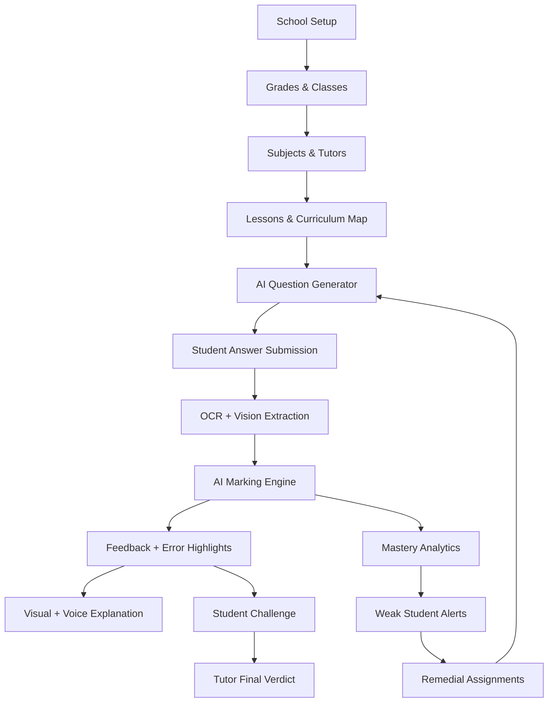
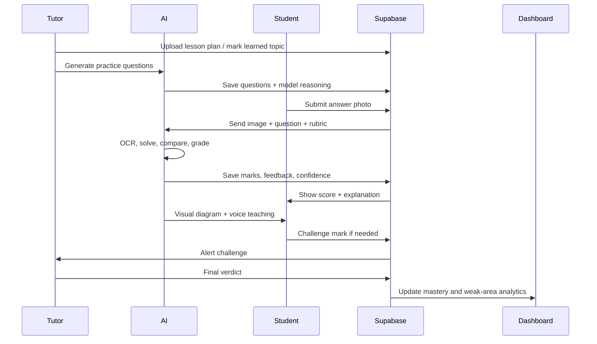
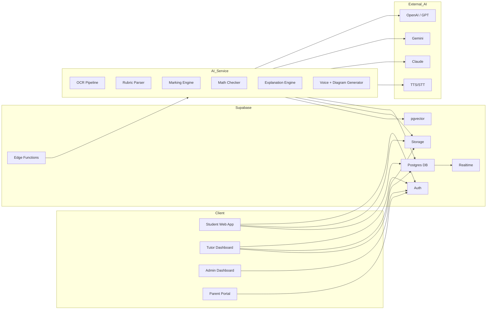
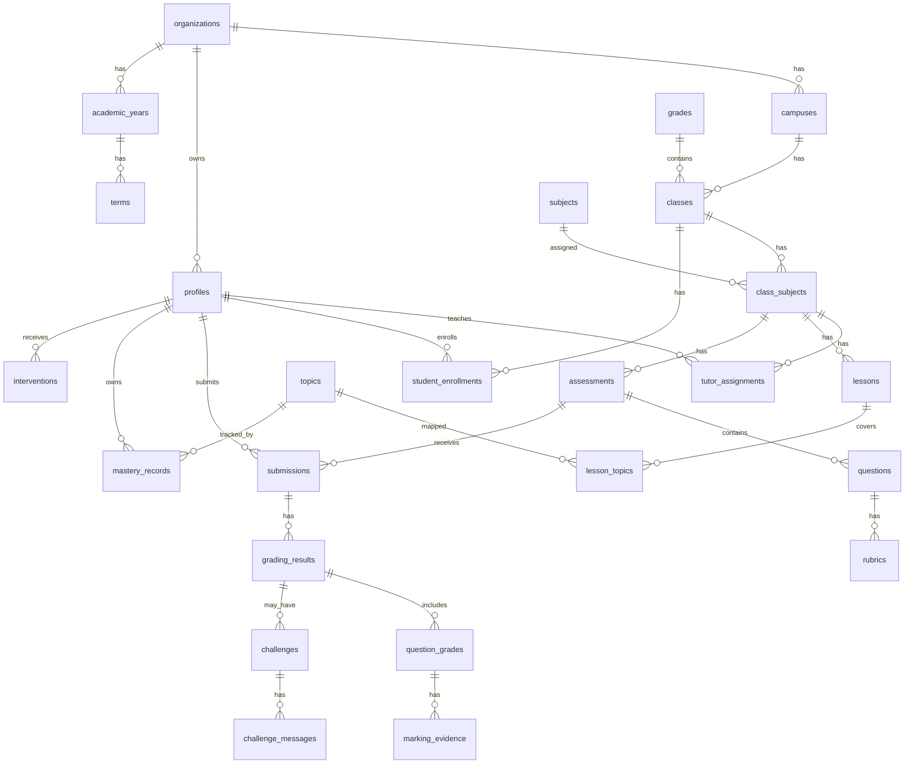
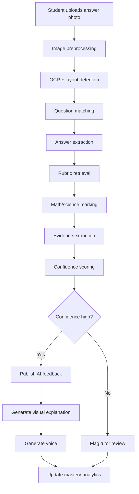
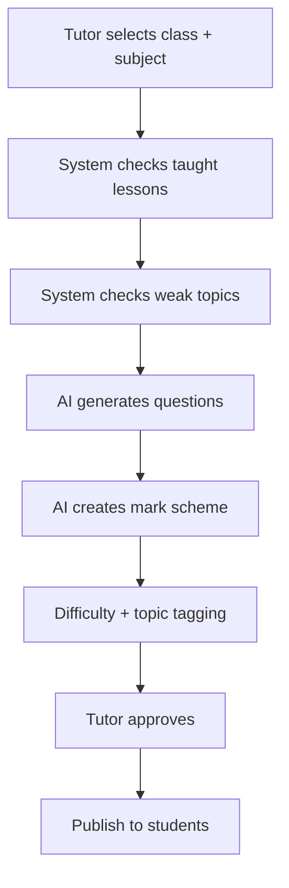
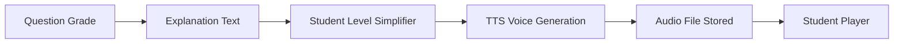
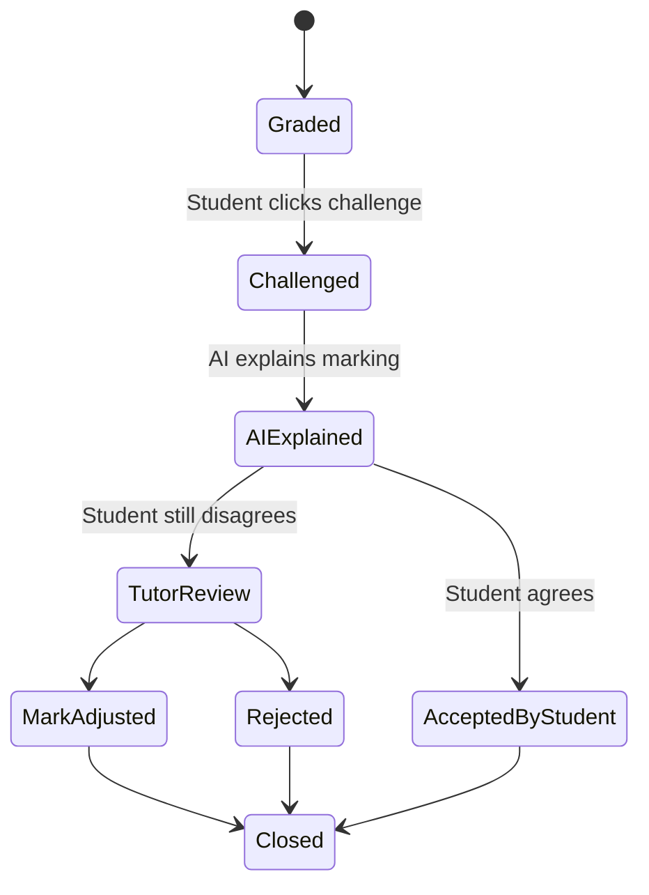
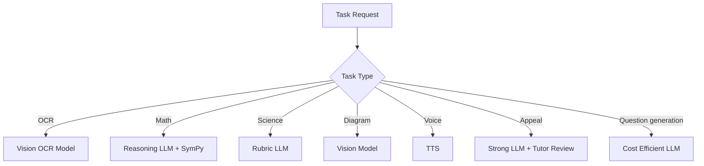
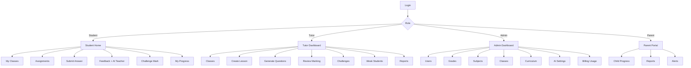

Virtual School AI Assessment & Learning Platform — Product + Technical Blueprint
0. Executive Direction
This platform is not only an AI marking app. It is a virtual school operating system where students, tutors, classes, subjects, assessments, learning gaps, AI explanations, challenges, and human teacher verdicts are connected into one learning loop.
The core truth of the product:
> **The goal is not to replace teachers. The goal is to make every weak student visible early, give each learner immediate feedback, and give tutors the evidence needed to intervene at the right time.**
The best version of this platform combines:
AI-generated practice questions
Past-paper and monthly-test marking
OCR and handwriting extraction
Step-by-step math/science reasoning checks
AI visual explanation with diagrams and voice
Student challenge/appeal flow
Tutor final verdict
Class mastery analytics
Weak-student alerts
Parent/school reporting
Supabase-backed secure school data model
Assessly is a good 70% base because it already shows document upload, OCR, rubric parsing, AI grading, grading canvas, WebSocket progress, and a Next.js/FastAPI architecture. This blueprint expands that idea into a full virtual school platform with classes, grades, tutors, subjects, learning paths, appeals, AI tutor voice/visual teaching, mastery tracking, and Supabase as the main backend.
---
1. Product Name Options
Working names:
EduMark AI
Assessly School
LearnVerdict
TutorLens AI
ClassMaster AI
NexusLearn
AI Virtual School OS
Recommended: NexusLearn AI  
Reason: it fits a full learning platform, not only grading.
---
2. User Roles
2.1 Platform Admin
Controls the full SaaS platform.
Responsibilities:
Manage schools/institutes
Manage subscription plans
Monitor usage and AI costs
Manage global curriculum templates
Review safety and quality analytics
Manage model settings
View system logs and escalations
2.2 School Admin / Institute Owner
Controls one school or tuition institute.
Responsibilities:
Create grades, subjects, classes, terms
Add tutors and students
Assign tutors to classes
Upload school-specific marking schemes
Monitor school-wide learning performance
Export reports
2.3 Tutor / Teacher
The human final authority.
Responsibilities:
Create lessons, assignments, tests
Review AI-created questions
Approve marking schemes
View AI marking results
Override marks
Respond to student challenges
Identify weak students
Assign remedial work
Record final verdict
2.4 Student
Learns, answers, reviews, challenges, and improves.
Responsibilities:
Join assigned classes
Attend lessons
Submit answers by photo, typed input, audio, or document
Review AI feedback
Watch/listen to AI explanation
Retry weak areas
Challenge unfair marks
Track own progress
2.5 Parent / Guardian
Optional role for progress visibility.
Responsibilities:
View student progress
See weak areas and improvement
Receive alerts
View attendance and test performance
2.6 AI Tutor
System role, not a human account.
Responsibilities:
Generate questions from learned content
Mark answers against rubrics
Explain errors
Create diagrams
Speak explanations
Suggest remedial practice
Detect learning gaps
Flag low-confidence marking for tutor review
---
3. Core Product Modules

Main modules:
Authentication and user management
School/institute management
Grade, class, subject, and tutor allocation
Curriculum and lesson tracking
Question bank and AI question generation
Assessment/test/assignment engine
Student submission capture
OCR and handwriting interpretation
AI marking engine
AI visual and voice explanation engine
Challenge and tutor verdict workflow
Learning mastery analytics
Weak-student intervention system
Parent/school reporting
Admin cost, quality, and safety monitoring
---
4. Core Learning Loop

---
5. Why AI Alone Is Not Enough
AI can assist marking but should not be trusted blindly for official marks.
Reasons:
Handwriting OCR can fail.
Math working may be correct but written in an unusual way.
Science wording can be valid even if different from the mark scheme.
Diagrams may be partially correct.
Some answers require examiner judgement.
Students must be allowed to appeal.
Therefore every AI mark needs:
```text
AI Mark + AI Confidence + Evidence + Explanation + Teacher Override
```
Final rule:
> **AI recommends. Tutor confirms when challenged or low-confidence.**
---
6. Recommended Tech Stack
6.1 Frontend
Next.js 15 or current stable Next.js
TypeScript
Tailwind CSS
shadcn/ui
Zustand or TanStack Query
React Hook Form
KaTeX / MathJax for equations
Excalidraw / tldraw-style canvas for diagrams
WebRTC or streaming API for voice explanation
Supabase Auth client
Supabase Realtime subscriptions
6.2 Backend
Recommended hybrid:
Supabase for auth, database, storage, realtime, vector search
Edge Functions for lightweight server-side actions
Python FastAPI microservice for heavy OCR/marking workflows
Redis queue only if needed later
Background job worker for batch marking
Webhook/event system for async grading updates
6.3 Database
Supabase PostgreSQL
Row Level Security enabled
pgvector for embeddings
Storage buckets for papers, submissions, audio, generated diagrams
Realtime for grading progress and challenge notifications
6.4 AI Providers
Use a routing layer, not direct hardcoding.
Recommended model routing:
Task	Recommended Model Type
Handwriting/photo OCR	Gemini Vision / GPT Vision / specialist OCR
Math marking	Strong reasoning model + symbolic checker
Science marking	LLM with rubric extraction
Diagram checking	Vision model
Voice explanation	TTS model
Speech input	STT model
Question generation	Cost-efficient LLM
Final review / appeal	Stronger LLM + tutor confirmation
Knowledge retrieval	Supabase pgvector + embeddings
6.5 Math Accuracy Add-ons
For math, add deterministic tools:
SymPy
MathJS
LaTeX parser
equation normalizer
step comparison engine
unit checker
significant figures checker
graph validation tool
Do not rely only on LLM text reasoning for math marks.
---
7. High-Level Architecture

---
8. Assessly-Based Starting Point
The Assessly repository already includes valuable pieces:
Next.js frontend
FastAPI backend
Upload flow for question, rubric, and student work
OCR extraction
AI rubric parsing
AI grading
Interactive grading canvas
PostgreSQL backend
Celery/Redis background jobs
WebSocket grading progress
Keep from Assessly:
```text
Upload + OCR + Rubric Parser + Grading Canvas + AI Feedback + Progress Updates
```
Replace or extend:
```text
Postgres local DB -> Supabase PostgreSQL
Basic classes -> Full school/class/subject model
Single grading workflow -> Learning loop + mastery analytics
Simple feedback -> voice + diagrams + remediation
No appeal workflow -> student challenge + tutor final verdict
No curriculum intelligence -> topic mastery + AI question generation
```
---
9. School Data Model
9.1 Entity Relationship Diagram

---
10. Supabase Database Schema
10.1 Extensions
```sql
create extension if not exists "uuid-ossp";
create extension if not exists vector;
create extension if not exists pg_trgm;
```
---
10.2 Enums
```sql
create type user_role as enum (
  'platform_admin',
  'school_admin',
  'tutor',
  'student',
  'parent'
);

create type assessment_type as enum (
  'practice',
  'homework',
  'monthly_test',
  'term_test',
  'past_paper',
  'diagnostic',
  'mock_exam'
);

create type submission_status as enum (
  'draft',
  'submitted',
  'ocr_processing',
  'grading',
  'graded',
  'needs_review',
  'challenged',
  'finalized',
  'failed'
);

create type challenge_status as enum (
  'open',
  'ai_explained',
  'tutor_reviewing',
  'accepted',
  'rejected',
  'mark_adjusted',
  'closed'
);

create type mastery_level as enum (
  'unknown',
  'weak',
  'developing',
  'secure',
  'advanced'
);
```
---
10.3 Core Tables
```sql
create table organizations (
  id uuid primary key default uuid_generate_v4(),
  name text not null,
  slug text unique not null,
  country text default 'Sri Lanka',
  curriculum text, -- Edexcel, Cambridge, Local, Custom
  created_at timestamptz default now()
);

create table campuses (
  id uuid primary key default uuid_generate_v4(),
  organization_id uuid not null references organizations(id) on delete cascade,
  name text not null,
  address text,
  created_at timestamptz default now()
);

create table profiles (
  id uuid primary key references auth.users(id) on delete cascade,
  organization_id uuid references organizations(id) on delete cascade,
  full_name text not null,
  display_name text,
  role user_role not null,
  email text,
  phone text,
  avatar_url text,
  is_active boolean default true,
  created_at timestamptz default now()
);

create table parent_student_links (
  id uuid primary key default uuid_generate_v4(),
  parent_id uuid not null references profiles(id) on delete cascade,
  student_id uuid not null references profiles(id) on delete cascade,
  relationship text,
  created_at timestamptz default now(),
  unique(parent_id, student_id)
);
```
---
10.4 Academic Structure
```sql
create table academic_years (
  id uuid primary key default uuid_generate_v4(),
  organization_id uuid not null references organizations(id) on delete cascade,
  name text not null,
  start_date date not null,
  end_date date not null,
  is_active boolean default false
);

create table terms (
  id uuid primary key default uuid_generate_v4(),
  academic_year_id uuid not null references academic_years(id) on delete cascade,
  name text not null,
  start_date date not null,
  end_date date not null
);

create table grades (
  id uuid primary key default uuid_generate_v4(),
  organization_id uuid not null references organizations(id) on delete cascade,
  name text not null, -- Grade 6, Grade 7, OL, AL
  sort_order int default 0
);

create table subjects (
  id uuid primary key default uuid_generate_v4(),
  organization_id uuid references organizations(id) on delete cascade,
  name text not null,
  code text,
  exam_board text, -- Edexcel, Cambridge, Local
  level text, -- Grade 6, OL, AL, IGCSE, IAS, IAL
  created_at timestamptz default now()
);

create table classes (
  id uuid primary key default uuid_generate_v4(),
  organization_id uuid not null references organizations(id) on delete cascade,
  campus_id uuid references campuses(id) on delete set null,
  grade_id uuid references grades(id) on delete set null,
  academic_year_id uuid references academic_years(id) on delete set null,
  name text not null,
  section text,
  created_at timestamptz default now()
);

create table class_subjects (
  id uuid primary key default uuid_generate_v4(),
  class_id uuid not null references classes(id) on delete cascade,
  subject_id uuid not null references subjects(id) on delete cascade,
  term_id uuid references terms(id) on delete set null,
  created_at timestamptz default now(),
  unique(class_id, subject_id, term_id)
);

create table tutor_assignments (
  id uuid primary key default uuid_generate_v4(),
  tutor_id uuid not null references profiles(id) on delete cascade,
  class_subject_id uuid not null references class_subjects(id) on delete cascade,
  is_lead boolean default false,
  created_at timestamptz default now(),
  unique(tutor_id, class_subject_id)
);

create table student_enrollments (
  id uuid primary key default uuid_generate_v4(),
  student_id uuid not null references profiles(id) on delete cascade,
  class_id uuid not null references classes(id) on delete cascade,
  academic_year_id uuid references academic_years(id) on delete set null,
  status text default 'active',
  created_at timestamptz default now(),
  unique(student_id, class_id, academic_year_id)
);
```
---
10.5 Curriculum, Lessons, and Topics
```sql
create table curriculum_units (
  id uuid primary key default uuid_generate_v4(),
  organization_id uuid references organizations(id) on delete cascade,
  subject_id uuid references subjects(id) on delete cascade,
  grade_id uuid references grades(id) on delete set null,
  title text not null,
  description text,
  sequence_no int default 0
);

create table topics (
  id uuid primary key default uuid_generate_v4(),
  curriculum_unit_id uuid references curriculum_units(id) on delete cascade,
  subject_id uuid references subjects(id) on delete cascade,
  title text not null,
  description text,
  prerequisite_topic_ids uuid[] default '{}',
  difficulty int default 1,
  sequence_no int default 0
);

create table lessons (
  id uuid primary key default uuid_generate_v4(),
  class_subject_id uuid not null references class_subjects(id) on delete cascade,
  tutor_id uuid references profiles(id) on delete set null,
  title text not null,
  lesson_date date,
  summary text,
  status text default 'planned', -- planned, taught, revised, cancelled
  created_at timestamptz default now()
);

create table lesson_topics (
  id uuid primary key default uuid_generate_v4(),
  lesson_id uuid not null references lessons(id) on delete cascade,
  topic_id uuid not null references topics(id) on delete cascade,
  coverage_level int default 1, -- 1 intro, 2 practiced, 3 tested
  created_at timestamptz default now(),
  unique(lesson_id, topic_id)
);

create table learning_resources (
  id uuid primary key default uuid_generate_v4(),
  topic_id uuid references topics(id) on delete cascade,
  title text not null,
  resource_type text, -- note, video, pdf, image, past_paper, worked_example
  storage_path text,
  external_url text,
  transcript text,
  embedding vector(1536),
  created_at timestamptz default now()
);
```
---
10.6 Assessments, Questions, Rubrics
```sql
create table assessments (
  id uuid primary key default uuid_generate_v4(),
  organization_id uuid not null references organizations(id) on delete cascade,
  class_subject_id uuid references class_subjects(id) on delete cascade,
  tutor_id uuid references profiles(id) on delete set null,
  title text not null,
  assessment_type assessment_type not null,
  instructions text,
  total_marks numeric(8,2) default 0,
  due_at timestamptz,
  source_type text, -- ai_generated, tutor_created, past_paper, monthly_test
  status text default 'draft', -- draft, published, closed, archived
  created_at timestamptz default now()
);

create table questions (
  id uuid primary key default uuid_generate_v4(),
  assessment_id uuid references assessments(id) on delete cascade,
  topic_id uuid references topics(id) on delete set null,
  question_no text,
  question_text text,
  question_image_path text,
  answer_format text, -- written, multiple_choice, calculation, diagram, file_upload
  difficulty int default 1,
  marks numeric(8,2) default 0,
  ai_generated boolean default false,
  generation_prompt text,
  expected_answer text,
  created_at timestamptz default now()
);

create table rubrics (
  id uuid primary key default uuid_generate_v4(),
  question_id uuid references questions(id) on delete cascade,
  rubric_json jsonb not null,
  mark_scheme_text text,
  version int default 1,
  created_by uuid references profiles(id) on delete set null,
  approved_by uuid references profiles(id) on delete set null,
  approved_at timestamptz,
  created_at timestamptz default now()
);
```
Example `rubric_json`:
```json
{
  "total_marks": 5,
  "criteria": [
    {
      "criterion_id": "M1",
      "type": "method",
      "marks": 1,
      "description": "Correctly substitutes values into formula"
    },
    {
      "criterion_id": "M2",
      "type": "method",
      "marks": 1,
      "description": "Correct algebraic rearrangement"
    },
    {
      "criterion_id": "A1",
      "type": "accuracy",
      "marks": 2,
      "description": "Correct numerical answer"
    },
    {
      "criterion_id": "U1",
      "type": "unit",
      "marks": 1,
      "description": "Correct unit included"
    }
  ],
  "acceptable_alternatives": [],
  "common_errors": []
}
```
---
10.7 Submissions and OCR
```sql
create table submissions (
  id uuid primary key default uuid_generate_v4(),
  assessment_id uuid not null references assessments(id) on delete cascade,
  student_id uuid not null references profiles(id) on delete cascade,
  status submission_status default 'draft',
  submitted_at timestamptz,
  total_score numeric(8,2),
  ai_confidence numeric(5,2),
  final_score numeric(8,2),
  finalized_by uuid references profiles(id) on delete set null,
  finalized_at timestamptz,
  created_at timestamptz default now(),
  unique(assessment_id, student_id)
);

create table submission_files (
  id uuid primary key default uuid_generate_v4(),
  submission_id uuid not null references submissions(id) on delete cascade,
  storage_path text not null,
  file_type text, -- image, pdf, audio
  page_no int,
  width int,
  height int,
  created_at timestamptz default now()
);

create table ocr_results (
  id uuid primary key default uuid_generate_v4(),
  submission_file_id uuid not null references submission_files(id) on delete cascade,
  provider text,
  raw_text text,
  structured_json jsonb,
  confidence numeric(5,2),
  bounding_boxes jsonb,
  created_at timestamptz default now()
);
```
---
10.8 Grading
```sql
create table grading_jobs (
  id uuid primary key default uuid_generate_v4(),
  submission_id uuid not null references submissions(id) on delete cascade,
  status text default 'queued',
  progress int default 0,
  started_at timestamptz,
  completed_at timestamptz,
  error_message text,
  model_router_json jsonb,
  created_at timestamptz default now()
);

create table grading_results (
  id uuid primary key default uuid_generate_v4(),
  submission_id uuid not null references submissions(id) on delete cascade,
  grading_job_id uuid references grading_jobs(id) on delete set null,
  total_ai_score numeric(8,2),
  total_possible numeric(8,2),
  overall_feedback text,
  strengths jsonb,
  weaknesses jsonb,
  next_steps jsonb,
  confidence numeric(5,2),
  needs_tutor_review boolean default false,
  created_at timestamptz default now()
);

create table question_grades (
  id uuid primary key default uuid_generate_v4(),
  grading_result_id uuid not null references grading_results(id) on delete cascade,
  question_id uuid not null references questions(id) on delete cascade,
  student_answer_text text,
  extracted_working_json jsonb,
  ai_score numeric(8,2),
  max_score numeric(8,2),
  confidence numeric(5,2),
  verdict text, -- correct, partial, incorrect, unclear
  feedback text,
  error_type text, -- concept, calculation, method, unit, diagram, handwriting_unclear
  corrected_answer text,
  tutor_score numeric(8,2),
  tutor_feedback text,
  final_score numeric(8,2),
  created_at timestamptz default now()
);

create table marking_evidence (
  id uuid primary key default uuid_generate_v4(),
  question_grade_id uuid not null references question_grades(id) on delete cascade,
  criterion_id text,
  awarded_marks numeric(8,2),
  max_marks numeric(8,2),
  evidence_text text,
  evidence_bbox jsonb,
  reason text,
  confidence numeric(5,2)
);
```
---
10.9 Challenge / Appeal Workflow
```sql
create table challenges (
  id uuid primary key default uuid_generate_v4(),
  submission_id uuid not null references submissions(id) on delete cascade,
  question_grade_id uuid references question_grades(id) on delete cascade,
  student_id uuid not null references profiles(id) on delete cascade,
  status challenge_status default 'open',
  reason text not null,
  ai_response text,
  tutor_id uuid references profiles(id) on delete set null,
  tutor_verdict text,
  old_score numeric(8,2),
  new_score numeric(8,2),
  closed_at timestamptz,
  created_at timestamptz default now()
);

create table challenge_messages (
  id uuid primary key default uuid_generate_v4(),
  challenge_id uuid not null references challenges(id) on delete cascade,
  sender_id uuid references profiles(id) on delete set null,
  sender_type text not null, -- student, ai, tutor
  message text not null,
  attachments jsonb,
  created_at timestamptz default now()
);
```
---
10.10 AI Explanation Engine
```sql
create table ai_explanations (
  id uuid primary key default uuid_generate_v4(),
  question_grade_id uuid references question_grades(id) on delete cascade,
  student_id uuid references profiles(id) on delete cascade,
  explanation_type text, -- text, voice, diagram, animation, worked_example
  explanation_text text,
  diagram_json jsonb,
  audio_storage_path text,
  video_storage_path text,
  language text default 'en',
  style text default 'teacher',
  created_at timestamptz default now()
);
```
Example `diagram_json`:
```json
{
  "type": "math_worked_example",
  "canvas": {
    "width": 1024,
    "height": 768
  },
  "steps": [
    {
      "title": "Identify the formula",
      "latex": "a^2 + b^2 = c^2",
      "highlight": ["c is the longest side"]
    },
    {
      "title": "Substitute values",
      "latex": "3^2 + 4^2 = c^2"
    },
    {
      "title": "Solve",
      "latex": "9 + 16 = 25 \\Rightarrow c = 5"
    }
  ]
}
```
---
10.11 Mastery Analytics
```sql
create table mastery_records (
  id uuid primary key default uuid_generate_v4(),
  student_id uuid not null references profiles(id) on delete cascade,
  topic_id uuid not null references topics(id) on delete cascade,
  subject_id uuid references subjects(id) on delete cascade,
  mastery_level mastery_level default 'unknown',
  mastery_score numeric(5,2) default 0,
  attempts int default 0,
  correct_count int default 0,
  partial_count int default 0,
  incorrect_count int default 0,
  last_attempt_at timestamptz,
  evidence jsonb,
  updated_at timestamptz default now(),
  unique(student_id, topic_id)
);

create table class_topic_analytics (
  id uuid primary key default uuid_generate_v4(),
  class_subject_id uuid not null references class_subjects(id) on delete cascade,
  topic_id uuid not null references topics(id) on delete cascade,
  avg_mastery_score numeric(5,2),
  weak_count int default 0,
  developing_count int default 0,
  secure_count int default 0,
  advanced_count int default 0,
  last_calculated_at timestamptz default now(),
  unique(class_subject_id, topic_id)
);

create table interventions (
  id uuid primary key default uuid_generate_v4(),
  student_id uuid not null references profiles(id) on delete cascade,
  topic_id uuid references topics(id) on delete set null,
  tutor_id uuid references profiles(id) on delete set null,
  class_subject_id uuid references class_subjects(id) on delete set null,
  reason text,
  recommended_action text,
  status text default 'open', -- open, assigned, completed, closed
  due_at timestamptz,
  created_at timestamptz default now()
);
```
---
10.12 AI Logs and Quality Control
```sql
create table ai_model_calls (
  id uuid primary key default uuid_generate_v4(),
  organization_id uuid references organizations(id) on delete cascade,
  user_id uuid references profiles(id) on delete set null,
  task_type text not null,
  provider text,
  model text,
  prompt_tokens int,
  completion_tokens int,
  total_cost numeric(12,6),
  latency_ms int,
  request_hash text,
  response_summary text,
  confidence numeric(5,2),
  created_at timestamptz default now()
);

create table ai_quality_reviews (
  id uuid primary key default uuid_generate_v4(),
  grading_result_id uuid references grading_results(id) on delete cascade,
  reviewed_by uuid references profiles(id) on delete set null,
  issue_type text,
  severity text,
  notes text,
  correction_json jsonb,
  created_at timestamptz default now()
);
```
---
11. Storage Buckets
Supabase Storage buckets:
```text
school-assets
lesson-resources
question-papers
marking-schemes
student-submissions
ocr-previews
annotated-papers
ai-diagrams
ai-audio-explanations
reports
```
Recommended path structure:
```text
organizations/{org_id}/classes/{class_id}/assessments/{assessment_id}/questions/{file}
organizations/{org_id}/students/{student_id}/submissions/{submission_id}/page-1.jpg
organizations/{org_id}/explanations/{question_grade_id}/diagram.json
organizations/{org_id}/explanations/{question_grade_id}/audio.mp3
```
---
12. Row Level Security Strategy
Supabase RLS must be enabled for exposed tables.
12.1 Access Rules
User	Access
Platform admin	All platform data
School admin	Own organization data
Tutor	Classes and subjects assigned to them
Student	Own classes, own submissions, own feedback
Parent	Linked child progress only
AI service role	Controlled backend-only access
12.2 Example Policies
```sql
alter table profiles enable row level security;
alter table submissions enable row level security;
alter table grading_results enable row level security;
alter table challenges enable row level security;

create policy "users can view own profile"
on profiles for select
using (id = auth.uid());

create policy "students can view own submissions"
on submissions for select
using (student_id = auth.uid());

create policy "students can insert own submissions"
on submissions for insert
with check (student_id = auth.uid());

create policy "students can view own grading results"
on grading_results for select
using (
  submission_id in (
    select id from submissions where student_id = auth.uid()
  )
);
```
For tutors, create a helper SQL function:
```sql
create or replace function is_tutor_for_submission(submission_uuid uuid)
returns boolean
language sql
security definer
as $$
  select exists (
    select 1
    from submissions s
    join assessments a on a.id = s.assessment_id
    join tutor_assignments ta on ta.class_subject_id = a.class_subject_id
    where s.id = submission_uuid
    and ta.tutor_id = auth.uid()
  );
$$;
```
Policy:
```sql
create policy "tutors can view assigned submissions"
on submissions for select
using (is_tutor_for_submission(id));
```
---
13. AI Marking Pipeline
13.1 End-to-End Flow

---
13.2 Image Preprocessing
Before OCR:
Auto-rotate image
Detect page boundaries
Crop paper
Increase contrast
De-shadow image
Detect question numbers
Split multi-question pages
Store original and processed image
Output:
```json
{
  "pages": [
    {
      "page_no": 1,
      "processed_image_path": "...",
      "detected_regions": [
        {
          "type": "answer_block",
          "question_no": "2b",
          "bbox": [120, 300, 800, 520]
        }
      ]
    }
  ]
}
```
---
13.3 OCR Output Format
```json
{
  "student_work": [
    {
      "question_no": "1a",
      "raw_text": "x = 5",
      "latex": "x=5",
      "confidence": 0.92,
      "bbox": [100, 220, 500, 260]
    }
  ],
  "unclear_regions": [
    {
      "bbox": [100, 500, 400, 580],
      "reason": "handwriting unclear"
    }
  ]
}
```
---
13.4 Marking JSON Output
The marking engine must always return structured JSON.
```json
{
  "submission_id": "uuid",
  "total_score": 8,
  "total_possible": 10,
  "confidence": 0.86,
  "needs_tutor_review": false,
  "question_results": [
    {
      "question_id": "uuid",
      "question_no": "1a",
      "score": 2,
      "max_score": 2,
      "verdict": "correct",
      "feedback": "Correct substitution and final answer.",
      "criteria": [
        {
          "criterion_id": "M1",
          "awarded": 1,
          "max": 1,
          "evidence": "Student used correct formula."
        },
        {
          "criterion_id": "A1",
          "awarded": 1,
          "max": 1,
          "evidence": "Final answer is correct."
        }
      ],
      "common_error_tag": null,
      "next_practice_topic_ids": []
    }
  ]
}
```
---
14. Marking Logic by Subject
14.1 Maths
The platform should mark:
final answer
method marks
algebraic steps
geometry diagrams
units
significant figures
graph plotting
formula substitution
explanation quality
Math marking should use:
```text
OCR → LaTeX extraction → symbolic normalization → step validation → rubric marks → AI explanation
```
Important rule:
> In math, a wrong final answer can still earn method marks.
Example:
```text
Question: Solve 2x + 3 = 11
Student: 2x = 11 - 3, 2x = 8, x = 5
AI result:
- M1 awarded for correct rearrangement
- M2 awarded for subtracting correctly
- A1 lost because x should be 4
```
14.2 Science
Science marking should use:
keyword and concept matching
alternative wording acceptance
diagram/label checking
required terminology
process sequence validation
missing key points detection
Example:
```text
Question: Explain photosynthesis.
Student: Plants use sunlight to make food.
AI result:
- Partial credit
- Missing carbon dioxide, water, chlorophyll, glucose, oxygen
- Suggest revision on word equation
```
14.3 OL / AL Handling
OL and AL require tighter marking.
Features:
exam-board-specific mark schemes
command word interpretation
answer style training
past paper mode
examiner-style feedback
structured answer planning
topic-level weakness mapping
Command words:
Command Word	Expected Student Action
State	Give a short direct answer
Describe	Say what happens
Explain	Give reason and cause
Calculate	Show working and answer
Compare	Similarities and differences
Evaluate	Give judgement using evidence
---
15. AI Question Generation
15.1 Sources
Questions can be generated from:
topics already taught
weak topics
previous wrong answers
monthly test plan
past paper style
tutor-selected difficulty
curriculum unit
student mastery level
15.2 Question Generation Flow

15.3 Question Generation Prompt Template
```text
You are an expert {exam_board} {subject} tutor.

Generate {count} questions for:
Grade/Level: {grade}
Subject: {subject}
Topics taught: {topics}
Weak areas: {weak_topics}
Difficulty mix: {difficulty_mix}
Assessment purpose: {practice/monthly_test/past_paper_revision}

Requirements:
- Use exam-appropriate wording.
- Include marks per question.
- Include step-by-step mark scheme.
- Include common mistakes.
- Include topic tags.
- Include expected working for math.
- Do not include content outside taught topics unless marked as extension.

Return strict JSON.
```
---
16. AI Visual + Voice Teaching
This is the feature that makes the platform feel like a real teacher.
16.1 Student Feedback Screen
After marking, student sees:
```text
Score: 6 / 10
Topic: Algebraic Equations
Status: Developing
Main issue: Sign error when moving terms
```
Then:
paper image with red/green highlights
step-by-step correction
“Explain with voice” button
“Show diagram” button
“Try similar question” button
“Challenge this mark” button
16.2 Visual Explanation Types
Subject	Visual Type
Algebra	step-by-step equation board
Geometry	labelled diagram
Graphs	coordinate graph
Physics	force/energy diagram
Chemistry	particle/structure diagram
Biology	labelled organ/process diagram
Statistics	chart/table
Ratios	bar model
16.3 Voice Explanation Flow

Voice style:
calm
encouraging
short
step-by-step
no shame
ask student to try again
Example:
```text
"You got the first step right. The mistake happened when you moved minus three to the other side. When a term crosses the equals sign, its sign changes. Let's fix that slowly..."
```
---
17. Student Challenge Flow
17.1 Why Challenge Matters
Students must trust the system. A challenge system protects fairness.
17.2 Challenge Flow

17.3 Challenge UI
Student sees:
```text
Why do you think this mark is wrong?
[ ] My answer is correct
[ ] My method deserves marks
[ ] AI misunderstood my handwriting
[ ] Mark scheme has alternative answer
[ ] Other
```
Student can type explanation and attach another photo.
AI first response:
restates the marking evidence
checks if OCR misunderstood answer
gives a fair explanation
asks student if they still want tutor review
Tutor final verdict screen:
original paper
OCR extracted answer
AI awarded marks
student challenge reason
AI explanation
rubric
buttons:
Keep mark
Adjust mark
Request resubmission
Add tutor feedback
---
18. Tutor Dashboard
18.1 Home Dashboard
Cards:
Today’s pending submissions
Low-confidence AI marks
Open student challenges
Weak students needing attention
Topics with class-wide difficulty
Upcoming tests
AI cost usage
18.2 Class Mastery View
```text
Class: Grade 8A Mathematics
Topic: Algebraic Expansion

Students:
- Secure: 12
- Developing: 8
- Weak: 5
- Needs urgent help: 3
```
Heatmap:
Student	Expansion	Factorisation	Equations	Ratios
Amal	Secure	Developing	Weak	Secure
Nisha	Weak	Weak	Developing	Secure
Ravi	Advanced	Secure	Secure	Developing
18.3 Weak Student Alert
Trigger conditions:
below 50% in two assessments
same error repeated three times
missed prerequisite topic
challenge frequency high
OCR confusion causing repeated unclear submissions
no activity for 7 days
Intervention card:
```text
Student: Nisha
Subject: Mathematics
Weak topic: Factorisation
Evidence:
- Lost 6 marks across 3 attempts
- Repeated sign error
Recommended:
- Assign 5-step remedial set
- Tutor review 10 minutes
```
---
19. Student UX
19.1 Student Home
Sections:
Today’s tasks
Continue learning
Corrections to review
Challenges
Weak topics
Streak and progress
Ask AI tutor
19.2 Assignment Page
Steps:
Read question
Upload photo / type answer / record voice
Preview image
Submit
See grading progress
Review marks
Watch explanation
Retry
19.3 Feedback Page
Layout:
```text
Left: Student paper image with highlights
Right: Score, feedback, correction steps
Bottom: Voice player + diagram canvas + retry button
```
19.4 AI Tutor Chat
Chat must not be plain text only.
When explaining:
render equations
draw diagrams
show worked examples
use voice
ask short check questions
adapt to grade level
Example interaction:
```text
AI: You made a sign error. Let me show it visually.
[Equation board appears]
AI Voice: "Look at this minus three. When we move it..."
Student: "I still don't get it."
AI: "No problem. Let's use a number example first."
```
---
20. Admin UX
20.1 School Admin Screens
School setup
Users
Classes
Subjects
Tutor assignments
Curriculum mapping
Assessment templates
Reports
Billing/usage
AI quality settings
20.2 Platform Admin Screens
All schools
AI usage
Cost per organization
Error logs
Abuse/safety logs
Model performance
Feature flags
Subscription plans
---
21. API Design
21.1 Authentication
Handled by Supabase Auth.
21.2 Main API Routes
```text
POST /api/classes
GET  /api/classes/:id
POST /api/classes/:id/enroll

POST /api/lessons
POST /api/lessons/:id/topics

POST /api/assessments
POST /api/assessments/:id/publish

POST /api/questions/generate
POST /api/rubrics/parse

POST /api/submissions
POST /api/submissions/:id/files
POST /api/submissions/:id/start-grading

GET  /api/grading-jobs/:id
GET  /api/submissions/:id/results

POST /api/challenges
POST /api/challenges/:id/ai-explain
POST /api/challenges/:id/tutor-verdict

GET  /api/mastery/student/:student_id
GET  /api/mastery/class/:class_subject_id

POST /api/explanations/generate
GET  /api/explanations/:question_grade_id
```
---
22. Edge Functions
Recommended Supabase Edge Functions:
```text
generate-questions
parse-rubric
start-grading-job
create-ai-explanation
generate-voice
calculate-mastery
notify-tutor
handle-challenge
```
Heavy OCR and batch marking can run in FastAPI service instead.
---
23. Realtime Events
Use Supabase Realtime for:
grading progress
challenge messages
tutor verdict notifications
student submission status
class dashboard updates
Example channels:
```text
submission:{submission_id}
challenge:{challenge_id}
class_subject:{class_subject_id}
student:{student_id}
```
---
24. Mastery Scoring Algorithm
Each topic gets a score from 0 to 100.
Suggested formula:
```text
mastery_score =
  0.45 * recent_assessment_score
+ 0.25 * consistency_score
+ 0.15 * retry_improvement
+ 0.10 * confidence_weight
+ 0.05 * attendance_or_activity
```
Mastery levels:
Score	Level
0-39	Weak
40-64	Developing
65-84	Secure
85-100	Advanced
Repeated mistakes reduce score more heavily than one-off errors.
---
25. AI Confidence Rules
25.1 Force Tutor Review If:
OCR confidence below 75%
AI marking confidence below 80%
student answer is mostly diagram
answer contains unreadable handwriting
AI detects possible alternative correct answer
score difference between two model checks > 15%
student challenges mark
high-stakes assessment type
25.2 Safe Auto-Publish If:
OCR confidence high
rubric criteria matched clearly
answer type simple
not high-stakes
no contradiction between checker and LLM
model confidence high
---
26. AI Model Router

Router table:
Task	First Model	Backup	Human Review
OCR	Gemini Vision	GPT Vision	If unclear
Math marking	GPT reasoning + SymPy	Claude/Gemini	Low confidence
Science marking	Gemini/GPT	Claude	Challenge
Question generation	Gemini Flash/GPT mini	GPT stronger	Tutor approval
Voice explanation	TTS	browser TTS fallback	Not needed
Appeal review	Strong LLM	second model	Always tutor final
---
27. Prompt Library
27.1 Rubric Parser Prompt
```text
You are an expert examiner.

Convert this marking scheme into strict JSON.

Rules:
- Preserve total marks.
- Split method marks and accuracy marks.
- Identify accepted alternatives.
- Identify common mistakes.
- Identify required units.
- Identify command words.
- Return only valid JSON.

Input:
{mark_scheme_text}
```
27.2 Marking Prompt
```text
You are an AI marking assistant. You do not replace the tutor.

Mark the student answer using only the provided question and rubric.

Return strict JSON with:
- score
- max_score
- awarded criteria
- lost criteria
- evidence from student work
- feedback
- confidence
- needs_tutor_review
- corrected answer
- topic weakness tags

Important:
- Award method marks when valid even if final answer is wrong.
- Accept equivalent correct wording.
- If handwriting/OCR is unclear, do not guess. Flag tutor review.
- If the answer may be correct but not in the mark scheme, flag tutor review.
```
27.3 Explanation Prompt
```text
You are a kind but precise teacher.

Explain this mistake to a student at {grade_level}.

Use:
- simple words
- short steps
- one worked example
- one mini-check question
- no shame
- no overly long lecture

Return:
- explanation_text
- board_steps with LaTeX
- diagram_json if useful
- voice_script
- retry_question
```
27.4 Weak Student Alert Prompt
```text
Analyze the student performance evidence.

Find:
- repeated mistakes
- missing prerequisite concepts
- urgency level
- recommended tutor action
- recommended AI practice set
- parent-friendly summary

Return strict JSON.
```
---
28. UI / UX Screen Map

---
29. Page-by-Page UX
29.1 Login
Email/password
Google login optional
School code optional
Role-based redirect
29.2 Student Dashboard
Cards:
Today’s class
Pending homework
Marked papers
Weak topics
Ask AI Tutor
Continue corrections
29.3 Assignment Submit Page
Components:
question viewer
upload answer photo
camera capture
crop/rotate tool
“submit for marking”
progress animation
29.4 Marked Paper Page
Components:
paper image viewer
bounding-box highlights
question-by-question marks
lost marks
corrected solution
voice explanation
diagram canvas
retry button
challenge button
29.5 Tutor Review Page
Components:
AI score
confidence score
rubric criteria
student answer
original image
AI evidence
edit marks
final verdict
save comment
29.6 Class Analytics Page
Components:
class heatmap
weak topic ranking
student ranking by need
topic trend chart
intervention button
export PDF
29.7 AI Question Generator Page
Inputs:
class
subject
topic
difficulty
number of questions
assessment type
past-paper style
marks
time limit
Outputs:
generated questions
mark scheme
common mistakes
tutor approve/edit/publish
---
30. Component Architecture
```text
src/
  app/
    login/
    dashboard/
      student/
      tutor/
      admin/
      parent/
    classes/
    lessons/
    assessments/
    submissions/
    marking/
    challenges/
    mastery/
    settings/

  components/
    auth/
    layout/
    student/
    tutor/
    admin/
    marking/
      PaperViewer.tsx
      AnnotationLayer.tsx
      RubricPanel.tsx
      MarkBreakdown.tsx
      ChallengeButton.tsx
    ai-teacher/
      VoicePlayer.tsx
      DiagramCanvas.tsx
      EquationBoard.tsx
      StepExplanation.tsx
      RetryQuestion.tsx
    analytics/
      MasteryHeatmap.tsx
      WeakStudentList.tsx
      TopicTrendChart.tsx

  lib/
    supabase/
    api/
    ai/
    validators/
    permissions/
    utils/
```
---
31. Suggested Repository Structure
```text
nexuslearn-ai/
  apps/
    web/                         # Next.js app
    worker/                      # Optional background worker
  services/
    ai-marker/                   # FastAPI Python service
      app/
        routers/
        services/
          ocr_service.py
          rubric_parser.py
          marking_engine.py
          math_checker.py
          explanation_engine.py
          mastery_engine.py
        models/
        prompts/
        tests/
  supabase/
    migrations/
    functions/
      generate-questions/
      start-grading-job/
      create-ai-explanation/
      calculate-mastery/
    seed.sql
  packages/
    shared/
      types/
      schemas/
      prompts/
  docs/
    architecture.md
    database.md
    api.md
    ai-prompts.md
    deployment.md
```
---
32. MVP Scope
MVP Goal
A working virtual school assessment loop:
```text
Admin creates class → tutor creates assessment → student uploads photo → AI marks → student sees feedback → tutor reviews challenged/low-confidence marks → dashboard shows weak topics.
```
MVP Features
Supabase Auth
Organization, class, subject, tutor, student setup
Assessment creation
Question and rubric upload
Student answer photo upload
OCR extraction
AI grading
Feedback display
Student challenge
Tutor verdict
Basic mastery dashboard
MVP Exclusions
Do not build in MVP:
full video classes
complex LMS
payment system
parent portal
advanced animations
full mobile app
offline mode
school timetable
marketplace
---
33. Phase Plan
Phase 1 — Foundation
Supabase project setup
Auth and roles
Core tables
RLS policies
Storage buckets
Class/student/tutor setup
Basic dashboards
Phase 2 — Assessment Engine
Assessment creation
Question upload
Rubric upload
Student photo submission
OCR result storage
Grading job status
Phase 3 — AI Marking
Rubric parser
OCR pipeline
marking JSON schema
math checker
science rubric checker
low-confidence review flag
Phase 4 — Feedback + Challenge
student feedback page
paper highlighting
AI explanation
challenge creation
tutor verdict page
Phase 5 — Mastery Intelligence
topic tagging
mastery records
weak student alerts
remedial question generation
class analytics
Phase 6 — AI Teacher Experience
voice explanation
diagram canvas
equation board
retry questions
adaptive explanation style
Phase 7 — Production Hardening
RLS audit
logging
AI cost tracking
queue scaling
backups
monitoring
school onboarding
---
34. Development Task Checklist
34.1 Supabase
[ ] Create Supabase project
[ ] Enable required extensions
[ ] Create enums
[ ] Create tables
[ ] Add indexes
[ ] Enable RLS
[ ] Create policies
[ ] Create storage buckets
[ ] Create seed data
[ ] Create edge functions
34.2 Frontend
[ ] Create Next.js app
[ ] Add Supabase auth
[ ] Build role redirect
[ ] Build admin dashboard
[ ] Build tutor dashboard
[ ] Build student dashboard
[ ] Build assessment editor
[ ] Build submission upload
[ ] Build marking result page
[ ] Build challenge page
[ ] Build mastery heatmap
34.3 AI Service
[ ] Create FastAPI service
[ ] Add OCR endpoint
[ ] Add rubric parser endpoint
[ ] Add marking endpoint
[ ] Add math checker
[ ] Add explanation generator
[ ] Add voice generation
[ ] Add mastery update endpoint
[ ] Add structured JSON validators
[ ] Add tests with sample papers
34.4 Tutor Quality Workflow
[ ] Low-confidence queue
[ ] Challenge queue
[ ] Mark override
[ ] Final verdict lock
[ ] Tutor comment
[ ] Student notification
34.5 Reporting
[ ] Student progress report
[ ] Class topic report
[ ] Weak student report
[ ] Assessment report
[ ] Parent-friendly summary
[ ] PDF export
---
35. Data Indexes
```sql
create index idx_profiles_org_role on profiles(organization_id, role);
create index idx_classes_org on classes(organization_id);
create index idx_class_subjects_class on class_subjects(class_id);
create index idx_enrollments_student on student_enrollments(student_id);
create index idx_assessments_class_subject on assessments(class_subject_id);
create index idx_submissions_assessment_student on submissions(assessment_id, student_id);
create index idx_question_grades_question on question_grades(question_id);
create index idx_mastery_student_topic on mastery_records(student_id, topic_id);
create index idx_challenges_status on challenges(status);
```
Vector index example:
```sql
create index learning_resources_embedding_idx
on learning_resources
using hnsw (embedding vector_cosine_ops);
```
---
36. Reports
36.1 Student Report
Includes:
overall subject performance
topic mastery
common mistakes
recent improvement
recommended practice
tutor comments
AI explanation history
36.2 Tutor Report
Includes:
class weak areas
students needing attention
repeated error patterns
test result distribution
topic coverage vs mastery
36.3 Admin Report
Includes:
tutor activity
class performance
AI usage cost
assessment completion
challenge rate
marking quality review
---
37. Key Metrics
Learning Metrics
topic mastery score
retry improvement rate
repeated error count
challenge success rate
time to correction
weak-student recovery rate
Teacher Metrics
pending review count
challenge resolution time
intervention completion rate
class improvement after revision
AI Quality Metrics
OCR confidence
marking confidence
tutor override rate
model disagreement rate
cost per paper
average marking time
---
38. Safety, Privacy, and Trust
Important principles:
Do not shame students.
Do not show class ranking to students.
Do not let AI give final high-stakes verdict without teacher authority.
Keep student data private by organization and role.
Log every mark change.
Explain why marks were awarded/lost.
Allow challenge and correction.
Use tutor as final authority.
Audit fields to add where needed:
```sql
created_by uuid
updated_by uuid
created_at timestamptz
updated_at timestamptz
deleted_at timestamptz
```
---
39. Cost Control
39.1 Reduce AI Cost
Cache parsed rubrics
Cache question embeddings
Use OCR only once per submission
Use cheaper models for simple practice
Use stronger models only for challenges/high-stakes
Batch process class submissions
Use deterministic math checker before LLM
Store generated explanations
39.2 AI Cost Table
Track:
organization
user
task type
model
token usage
image pages
audio seconds
cost
latency
---
40. Production Deployment
Recommended deployment:
```text
Frontend: Vercel
Database/Auth/Storage/Realtime: Supabase
AI Service: Render / Railway / Fly.io / Google Cloud Run
Queue: Supabase jobs or Redis later
Monitoring: Sentry + Supabase logs
```
For Sri Lanka/local tuition MVP:
```text
Start simple:
Next.js + Supabase + one FastAPI AI service
```
Do not overbuild Kubernetes at the beginning.
---
41. Main Risks and Mitigations
Risk	Mitigation
Wrong AI marking	confidence score + challenge + tutor verdict
Bad OCR	image preprocessing + manual review
High AI cost	model router + caching
Teachers distrust AI	show evidence and rubric criteria
Students misuse challenge	limit repeated weak challenges, but never block genuine appeal
Parents misunderstand scores	show progress and topic mastery, not only marks
Data privacy issue	RLS, storage policies, audit logs
Math hallucination	symbolic checker + strict JSON + low-confidence flags
---
42. Build Strategy From Assessly
Step 1
Fork Assessly and run locally.
Step 2
Freeze the current grading workflow.
Step 3
Add Supabase Auth and profiles.
Step 4
Replace local PostgreSQL models with Supabase schema.
Step 5
Keep FastAPI for AI marking only.
Step 6
Add school/class/student/tutor model.
Step 7
Add challenge flow.
Step 8
Add mastery analytics.
Step 9
Add AI teacher visual/voice explanation.
---
43. Final Product Principle
Every feature must answer one question:
> **Does this help the student understand faster, or help the teacher find the student who needs attention?**
If not, delay it.
The platform should not become a fancy AI toy. It should become a learning truth engine:
```text
What was taught?
What was understood?
What was misunderstood?
Who needs help?
What exact help is needed?
Did they improve after help?
```
That is the real value.
