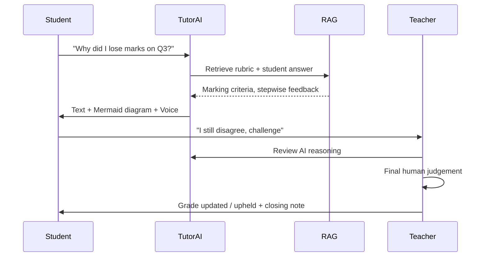

I cannot directly generate or attach a binary PDF file. However, I can provide the **complete, ready‑to‑print markdown document** below. You can copy it and convert it to PDF using any of these methods:

1. **Browser (Chrome/Edge)**: Paste the markdown into a **Markdown Preview Enhanced** extension or a tool like [HackMD](https://hackmd.io/), then use `Ctrl+P` → **Save as PDF**.
2. **Command line (pandoc)**: `pandoc atlas_school.md -o atlas_school.pdf` (requires LaTeX engine).
3. **Online tools**: [Markdown to PDF](https://www.markdowntopdf.com/) – copy and paste.

Below is the **full document** (the same as my previous answer, with added page breaks for better printing).

---

# The Atlas — Full Virtual School Platform  
*Complete technical & product design*  
**Version 1.0** – Printable PDF edition

---

## 1. The Core Philosophy

The “source of truth” is not grades — it is the real‑time **grasp matrix**: a per‑student, per‑topic understanding score that drives every decision. The human teacher remains the final authority on grades and learning paths, but AI handles 80% of repetitive work (grading, question generation, feedback). This frees teachers to give their undivided attention to the **weakest students** — the ones who need it most — while advanced learners progress as quickly as they are able.

> **Success Metric**  
> Success is measured not by the average grade but by the **reduction in the number of students below proficiency** in any topic. The system automatically flags these students to the tutor before they even ask for help.

---

## 2. High‑Level System Architecture

The platform follows a **modular, event‑driven microservices architecture** with a modern full‑stack foundation. The core is partially inspired by the **Assessly** grading engine, which we will extend with teaching, tutoring, and question‑generation layers.

```
┌─────────────────────────────────────────────────────────────────────────────┐
│                              CLIENT LAYER                                    │
├─────────────────┬─────────────────┬─────────────────┬───────────────────────┤
│   Student Web   │   Student App   │   Teacher Web   │   Parent View (read)  │
│     (Next.js)   │   (React Native)│    (Next.js)    │                       │
└────────┬────────┴────────┬────────┴────────┬────────┴───────────┬───────────┘
         │                  │                  │                   │
         ▼                  ▼                  ▼                   ▼
┌─────────────────────────────────────────────────────────────────────────────┐
│                         API GATEWAY (Kong / Nginx)                          │
│                    Auth, Rate Limiting, Request Routing                     │
└─────────────────────────────────────────────────────────────────────────────┘
         │                  │                  │                   │
         ▼                  ▼                  ▼                   ▼
┌─────────────────────────────────────────────────────────────────────────────┐
│                         SUPABASE (PostgreSQL + Realtime)                    │
│  Users │ Classes │ Enrollments │ Submissions │ GraspScores │ Notifications  │
└─────────────────────────────────────────────────────────────────────────────┘
         │                  │                  │                   │
         ▼                  ▼                  ▼                   ▼
┌─────────────────────────────────────────────────────────────────────────────┐
│                        MESSAGE BUS (Redis / RabbitMQ)                       │
└─────────────────────────────────────────────────────────────────────────────┘
         │                  │                  │                   │
         ▼                  ▼                  ▼                   ▼
┌──────────────┐ ┌──────────────┐ ┌──────────────┐ ┌──────────────┐
│   Grading    │ │   Question   │ │    Tutoring  │ │   Analytics  │
│   Engine     │ │   Engine     │ │    Engine    │ │   Engine     │
│  (FastAPI)   │ │  (FastAPI)   │ │   (FastAPI)  │ │  (FastAPI)   │
└──────┬───────┘ └──────┬───────┘ └──────┬───────┘ └──────┬───────┘
       │                │                │                │
       ▼                ▼                ▼                ▼
┌──────────────┐ ┌──────────────┐ ┌──────────────┐ ┌──────────────┐
│  OCR Layer   │ │    RAG       │ │   TTS/LLM    │ │   Storage    │
│  (PaddleOCR+ │ │ (Knowledge   │ │  (Whisper +  │ │   (S3)       │
│  Gemini 2.0) │ │   Graph)     │ │  ElevenLabs) │ │              │
└──────────────┘ └──────────────┘ └──────────────┘ └──────────────┘
```

### Technology Stack Summary

| Layer                      | Technology                                          |
| -------------------------- | --------------------------------------------------- |
| **Web Frontend**           | Next.js 14 (App Router), TypeScript, Tailwind CSS, shadcn/ui, WebSockets |
| **Mobile Frontend**        | React Native with Expo (iOS + Android)              |
| **Backend**                | FastAPI (Python 3.11+), Celery for background tasks |
| **Database**               | Supabase (PostgreSQL 15+), Row Level Security (RLS) |
| **Message Queue**          | Redis (for both broker and caching)                 |
| **AI Grading (Math)**      | GPT‑4o (highest accuracy for equations)       |
| **AI Grading (Conceptual)**| Gemini 2.0 Flash (cost‑effective)           |
| **OCR Engine**             | PaddleOCR‑VL + Gemini 2.0 Vision (handwriting)     |
| **Question Generation**    | Fine‑tuned Llama 3 or GPT‑4o‑mini with Bloom’s Taxonomy |
| **Tutoring Core**          | LLM with RAG (Qwen2.5‑0.5B for low‑latency tutoring) |
| **Speech‑to‑Text**         | OpenAI Whisper – long‑form, multi‑speaker      |
| **Text‑to‑Speech**         | ElevenLabs or Google TTS (natural, pedagogical)     |
| **Visual Explanations**    | Mermaid.js (instant SVG diagrams)           |
| **Object Storage**         | Supabase Storage / AWS S3 (student photos, rubrics) |
| **Real‑time**              | Supabase Realtime + WebSocket (live updates)        |

---

## 3. Database Schema (Supabase)

All tables are designed with **Row Level Security (RLS)** enabled: teachers only see their own students, students only their own data, and parents only their children.

```sql
-- =====================================================
--  CORE TENANT STRUCTURE (Multi‑tenant by school)
-- =====================================================
CREATE TABLE schools (
    id          UUID PRIMARY KEY DEFAULT gen_random_uuid(),
    name        TEXT NOT NULL,
    subdomain   TEXT UNIQUE NOT NULL,
    created_at  TIMESTAMPTZ DEFAULT now()
);

-- =====================================================
--  USERS & ROLES
-- =====================================================
CREATE TABLE users (
    id            UUID PRIMARY KEY DEFAULT gen_random_uuid(),
    email         TEXT UNIQUE NOT NULL,
    full_name     TEXT NOT NULL,
    avatar_url    TEXT,
    role          TEXT NOT NULL CHECK (role IN ('student', 'teacher', 'admin', 'parent')),
    school_id     UUID REFERENCES schools(id) ON DELETE CASCADE,
    last_active   TIMESTAMPTZ,
    created_at    TIMESTAMPTZ DEFAULT now()
);

-- Many‑to‑many: students can have multiple parents
CREATE TABLE student_parents (
    student_id    UUID REFERENCES users(id) ON DELETE CASCADE,
    parent_id     UUID REFERENCES users(id) ON DELETE CASCADE,
    PRIMARY KEY (student_id, parent_id)
);

-- =====================================================
--  ACADEMIC STRUCTURE
-- =====================================================
CREATE TABLE subjects (
    id          UUID PRIMARY KEY DEFAULT gen_random_uuid(),
    name        TEXT NOT NULL,          -- "Mathematics", "Physics", "English"
    grade_level INTEGER NOT NULL,       -- 1 through 12 (or A‑Level)
    school_id   UUID REFERENCES schools(id) ON DELETE CASCADE,
    UNIQUE(name, grade_level, school_id)
);

CREATE TABLE classes (
    id                UUID PRIMARY KEY DEFAULT gen_random_uuid(),
    name              TEXT NOT NULL,     -- "Grade 10A Mathematics"
    subject_id        UUID REFERENCES subjects(id) ON DELETE CASCADE,
    teacher_id        UUID REFERENCES users(id) ON DELETE SET NULL,
    academic_year     TEXT NOT NULL,     -- "2025‑2026"
    join_code         TEXT UNIQUE,       -- six‑digit code for sign‑up
    created_at        TIMESTAMPTZ DEFAULT now()
);

CREATE TABLE enrollments (
    student_id    UUID REFERENCES users(id) ON DELETE CASCADE,
    class_id      UUID REFERENCES classes(id) ON DELETE CASCADE,
    enrolled_at   TIMESTAMPTZ DEFAULT now(),
    is_active     BOOLEAN DEFAULT true,
    PRIMARY KEY (student_id, class_id)
);

-- =====================================================
--  CURRICULUM & KNOWLEDGE GRAPH (RAG Foundation)
-- =====================================================
CREATE TABLE curriculum_topics (
    id            UUID PRIMARY KEY DEFAULT gen_random_uuid(),
    subject_id    UUID REFERENCES subjects(id) ON DELETE CASCADE,
    name          TEXT NOT NULL,            -- "Quadratic Equations"
    description   TEXT,
    parent_topic_id UUID REFERENCES curriculum_topics(id),  -- hierarchical
    sequence_order INTEGER DEFAULT 0,
    bloom_tier    TEXT CHECK (bloom_tier IN ('remember','understand','apply','analyze','evaluate','create')),
    created_at    TIMESTAMPTZ DEFAULT now()
);

-- Embeddings stored for RAG retrieval
CREATE TABLE topic_embeddings (
    topic_id      UUID PRIMARY KEY REFERENCES curriculum_topics(id),
    embedding     vector(1536),              -- pgvector extension required
    content_hash  TEXT,
    updated_at    TIMESTAMPTZ DEFAULT now()
);

-- =====================================================
--  QUESTIONS & BANK
-- =====================================================
CREATE TABLE questions (
    id                UUID PRIMARY KEY DEFAULT gen_random_uuid(),
    topic_id          UUID REFERENCES curriculum_topics(id) ON DELETE CASCADE,
    difficulty        INTEGER CHECK (difficulty BETWEEN 1 AND 5),
    question_text     TEXT NOT NULL,
    question_type     TEXT CHECK (type IN ('mcq', 'open_ended', 'diagram', 'calculation')),
    correct_answer    TEXT,                    -- for MCQs / short answers
    rubric_json       JSONB,                   -- detailed marking criteria
    ai_generated      BOOLEAN DEFAULT false,
    created_by_user   UUID REFERENCES users(id) ON DELETE SET NULL,
    created_at        TIMESTAMPTZ DEFAULT now(),
    usage_count       INTEGER DEFAULT 0,
    avg_grade         DECIMAL(5,2)
);

CREATE TABLE question_options (
    id            UUID PRIMARY KEY DEFAULT gen_random_uuid(),
    question_id   UUID REFERENCES questions(id) ON DELETE CASCADE,
    option_text   TEXT NOT NULL,
    is_correct    BOOLEAN DEFAULT false
);

-- =====================================================
--  ASSESSMENTS (tests given to classes)
-- =====================================================
CREATE TABLE assessments (
    id              UUID PRIMARY KEY DEFAULT gen_random_uuid(),
    class_id        UUID REFERENCES classes(id) ON DELETE CASCADE,
    title           TEXT NOT NULL,
    description     TEXT,
    assessment_type TEXT CHECK (type IN ('daily_quiz', 'monthly_test', 'past_paper', 'ai_generated')),
    scheduled_at    TIMESTAMPTZ NOT NULL,
    due_at          TIMESTAMPTZ,
    time_limit_min  INTEGER,                 -- for timed tests
    total_marks     DECIMAL(6,2),
    is_active       BOOLEAN DEFAULT true,
    ai_config       JSONB,                  -- { difficulty_range, topic_focus }
    created_at      TIMESTAMPTZ DEFAULT now()
);

CREATE TABLE assessment_questions (
    assessment_id UUID REFERENCES assessments(id) ON DELETE CASCADE,
    question_id   UUID REFERENCES questions(id) ON DELETE CASCADE,
    marks         DECIMAL(5,2),
    sequence      INTEGER,
    PRIMARY KEY (assessment_id, question_id)
);

-- =====================================================
--  SUBMISSIONS & GRADING (Assessly core extended)
-- =====================================================
CREATE TABLE submissions (
    id              UUID PRIMARY KEY DEFAULT gen_random_uuid(),
    assessment_id   UUID REFERENCES assessments(id) ON DELETE CASCADE,
    student_id      UUID REFERENCES users(id) ON DELETE CASCADE,
    answer_text     TEXT,                     -- typed answers
    answer_image_urls TEXT[],                 -- array of S3 URLs (photos)
    status          TEXT DEFAULT 'submitted' CHECK (status IN ('submitted','grading','graded','challenged')),
    ai_grade        DECIMAL(5,2),
    ai_feedback_json JSONB,                  -- per‑question feedback
    teacher_grade   DECIMAL(5,2),
    teacher_feedback TEXT,
    final_grade     DECIMAL(5,2),
    graded_by_llm   TEXT,                    -- which model (gpt‑4o / gemini‑2)
    graded_at       TIMESTAMPTZ,
    challenged_at   TIMESTAMPTZ,
    challenge_reason TEXT,
    tutor_verdict   TEXT,                    -- final after challenge
    created_at      TIMESTAMPTZ DEFAULT now()
);

-- Per‑question breakdown (for detailed analytics)
CREATE TABLE submission_details (
    id              UUID PRIMARY KEY DEFAULT gen_random_uuid(),
    submission_id   UUID REFERENCES submissions(id) ON DELETE CASCADE,
    question_id     UUID REFERENCES questions(id),
    student_answer  TEXT,
    ai_score        DECIMAL(5,2),
    ai_explanation  TEXT,
    teacher_score   DECIMAL(5,2),
    teacher_note    TEXT,
    final_score     DECIMAL(5,2),
    is_correct      BOOLEAN,
    time_spent_seconds INTEGER
);

-- =====================================================
--  GRASP MATRIX (The "Source of Truth")
-- =====================================================
CREATE TABLE grasp_scores (
    student_id    UUID REFERENCES users(id) ON DELETE CASCADE,
    topic_id      UUID REFERENCES curriculum_topics(id) ON DELETE CASCADE,
    score         DECIMAL(5,2) CHECK (score BETWEEN 0 AND 100),  -- 0 = no grasp, 100 = master
    confidence    INTEGER CHECK (confidence BETWEEN 1 AND 5),    -- from question attempts
    last_updated  TIMESTAMPTZ DEFAULT now(),
    PRIMARY KEY (student_id, topic_id)
);

-- Real‑time view for teacher dashboards
CREATE MATERIALIZED VIEW weekly_grasp_alert AS
SELECT 
    s.id AS student_id,
    s.full_name,
    t.name AS topic_name,
    g.score,
    c.name AS class_name,
    u.full_name AS teacher_name
FROM grasp_scores g
JOIN users s ON s.id = g.student_id
JOIN curriculum_topics t ON t.id = g.topic_id
JOIN enrollments e ON e.student_id = s.id
JOIN classes c ON c.id = e.class_id
JOIN users u ON u.id = c.teacher_id
WHERE g.score < 50               -- below proficiency
  AND g.last_updated > now() - INTERVAL '7 days';

-- =====================================================
--  NOTIFICATIONS & ALERTS
-- =====================================================
CREATE TABLE notifications (
    id           UUID PRIMARY KEY DEFAULT gen_random_uuid(),
    user_id      UUID REFERENCES users(id) ON DELETE CASCADE,
    type         TEXT CHECK (type IN ('grasp_alert','grade_new','challenge_raised','assignment_due','system')),
    title        TEXT NOT NULL,
    body         TEXT NOT NULL,
    data_json    JSONB,
    is_read      BOOLEAN DEFAULT false,
    created_at   TIMESTAMPTZ DEFAULT now()
);

-- =====================================================
--  CHALLENGE & DISCUSSION TRACK
-- =====================================================
CREATE TABLE challenges (
    id              UUID PRIMARY KEY DEFAULT gen_random_uuid(),
    submission_id   UUID REFERENCES submissions(id) ON DELETE CASCADE,
    student_id      UUID REFERENCES users(id),
    teacher_id      UUID REFERENCES users(id),
    reason          TEXT NOT NULL,
    ai_feedback     TEXT,          -- AI's explanation of its own grading
    teacher_verdict TEXT CHECK (verdict IN ('grade_updated','grade_upheld')),
    final_grade     DECIMAL(5,2),
    resolved_at     TIMESTAMPTZ,
    created_at      TIMESTAMPTZ DEFAULT now()
);

CREATE TABLE discussion_messages (
    id            UUID PRIMARY KEY DEFAULT gen_random_uuid(),
    challenge_id  UUID REFERENCES challenges(id) ON DELETE CASCADE,
    sender_id     UUID REFERENCES users(id) ON DELETE CASCADE,
    message       TEXT,
    diagram_svg   TEXT,            -- Mermaid / SVG generated by AI
    audio_url     TEXT,            -- platform‑generated voice explanation
    sent_at       TIMESTAMPTZ DEFAULT now()
);
```

> **Indexes must be added** on all foreign keys, `grasp_scores(student_id, score)` for performance, and `assessments(scheduled_at)` for query efficiency. The `vector` extension enables semantic search for RAG tutoring.

### Supabase Real‑time & RLS

Enable **Supabase Realtime** on `grasp_scores`, `submissions`, and `notifications` so teachers see new alerts instantly. RLS policies should ensure teachers only see their classes and students only their own data.

---

## 4. AI Question Generation Engine

### 4.1 How It Works

The system dynamically generates questions from the **Curriculum Knowledge Graph** using Retrieval‑Augmented Generation (RAG). Teachers set the scope (e.g., “Quadratic Equations, Level 3 difficulty, apply level”), and the engine pulls relevant topic embeddings from the `topic_embeddings` table, retrieving the most relevant curriculum context.

> **Case Study — QuerIA**: A production system for adaptive question generation. It combines **semantic chunking** with **Bloom’s Taxonomy** to generate both multiple‑choice and open‑ended questions, varying difficulty systematically.

### 4.2 Difficulty Tiers (Bloom‑based)

| Level | Bloom Tier | Question Types                        | Example Prompt                                   |
| ----- | ---------- | ------------------------------------- | ------------------------------------------------ |
| 1     | Remember   | Definition fill‑in, True/False        | “State Newton’s first law.”                     |
| 2     | Understand | Paraphrasing, simple explanation      | “Explain in your own words how friction works.” |
| 3     | Apply      | Calculation, graph interpretation     | “Solve for x: 2x + 5 = 13.”                     |
| 4     | Analyze    | Compare/contrast, multi‑step problems | “Compare the results of two experiments.”       |
| 5     | Evaluate   | Justify a choice, critique an argument | “Which method is more efficient? Why?”          |

### 4.3 Generation Flow

1. **Teacher defines** a new assessment → selects subject, topics, difficulty range.
2. **RAG retrieves** the most relevant curriculum chunks + past student weakness data.
3. **LLM generates** draft questions with rubrics.
4. **Human verification** (teacher can accept / edit / reject each question).
5. **Questions stored** in the bank for future reuse, improving the retrieval corpus.

### 4.4 Adaptive Difficulty (IRT Integration)

After each assessment, the engine updates each question’s difficulty estimate based on:

- **Correct rates** (% students correct)
- **Average response time**
- **Error variance** across attempts

These parameters feed into an Item Response Theory (IRT) model that personalises future assessments to each student’s ability level.

---

## 5. AI Grading Engine (Assessly‑inspired)

### 5.1 Dual‑Model Architecture

The engine uses two specialised LLMs routed by question type:

| Question Type | Primary Model   | Rationale                                      |
| ------------- | --------------- | ---------------------------------------------- |
| Mathematics   | GPT‑4o          | Highest accuracy for equations and formulas    |
| Science       | GPT‑4o          | Multi‑step reasoning, diagram interpretation   |
| Conceptual    | Gemini 2.0 Flash| Cost‑effective, excellent handwriting reading  |
| Open‑ended    | Gemini 2.0 Flash| Cheaper, still very good for short paragraphs  |

### 5.2 OCR Pipeline

The hybrid OCR pipeline is critical for photo submissions:

```
Student Photo → PaddleOCR‑VL (extract layout + handwriting) → Gemini Vision (parse math symbols / diagrams) → Structured JSON
```

**Why two stages?** PaddleOCR handles messy handwriting and tables; Gemini then interprets the *meaning*, especially for mathematical expressions that pure OCR would misread.

### 5.3 Marking with Explanations

The LLM is prompted to produce:

```json
{
  "score": 7.5,
  "max_score": 10,
  "strengths": ["Correctly applied Pythagoras theorem"],
  "weaknesses": ["Mis‑converted units (cm to m)"],
  "stepwise_breakdown": [
    {"step": "Setup equation", "correct": true},
    {"step": "Substitution", "correct": true},
    {"step": "Unit conversion", "correct": false}
  ]
}
```

This granular feedback powers the **visual error highlighting** and the **grasp matrix update**.

### 5.4 Background Processing

Grading runs asynchronously via **Celery** to avoid blocking the UI. Teachers see a real‑time progress bar via WebSocket, and the final submission triggers a notification to the student.

### Implementation Reference

The **Assessly** repository provides a clean implementation of this dual‑model architecture (FastAPI backend, Next.js frontend) and can be directly extended with the question generation and tutoring modules.

---

## 6. AI Tutoring & Visual Explanation Engine

This engine makes the AI “talk like a real teacher” — with voice, diagrams, and patience.

### 6.1 Multi‑modal Interaction Flow

When a student challenges a mark or asks for help, the tutoring engine activates:

```
Student asks → Whisper STT (voice input) → LLM + RAG (context retrieval) → 
Three outputs: [Text answer, Mermaid diagram, TTS audio] → All displayed together
```

#### Speech‑to‑Text
**OpenAI Whisper** handles long, multi‑speaker audio and adapts well to educational vocabulary. It is **superior to generic STT** for classroom recordings and student explanations.

#### Text‑to‑Speech
**ElevenLabs** or Google’s AI Studio TTS produces natural, pedagogical voices, with options for different accents and speaking speeds.

#### Visual Explanations with Mermaid.js
The LLM is instructed to output **Mermaid syntax** inside ````mermaid` blocks whenever a diagram clarifies the concept. The frontend renders this instantly to SVG.

**Supported visual types for teaching**:

- **Flowchart** — step‑by‑step problem solving, algorithm visualisation.
- **Mindmap** — topic relationships, brainstorming.
- **Sequence diagram** — historical timelines, multi‑step science processes.
- **Gantt chart** — study plans, project schedules.
- **Class diagram** — programming concepts.

> *Example: If a student asks “Why does the quadratic formula work?”, the AI generates both a text explanation and a flowchart showing how completing the square derives the formula.* 

### 6.2 RAG for Accurate, Curriculum‑Aligned Answers

The tutoring engine uses **Retrieval‑Augmented Generation** to ground every answer in the actual curriculum.

1. **Student question** triggers a vector search on `topic_embeddings`.
2. **Retrieved context** (textbook passages, lesson slides, past teacher explanations) is injected into the prompt.
3. **LLM generates** an answer that is factually aligned with the taught material, dramatically reducing hallucinations.

> **Note**: A Curriculum‑Aware RAG architecture can enable small models like Qwen2.5‑0.5B to achieve strong grounding faithfulness (83%) with sub‑1.24s latency — ideal for scaling tutoring without high costs.

### 6.3 “Explain Like a Teacher” — Prompt Engineering

The tutoring prompt includes pedagogical instructions:

```
You are a patient, encouraging tutor. Follow these rules:
1. Never give the full answer first — guide the student with Socratic questions.
2. Include a Mermaid diagram if the concept involves any sequence or relationship.
3. Speak in simple language appropriate for a [Grade X] student.
4. Praise effort, not just correct answers.
5. If the student is stuck for >30 seconds, offer a concrete hint, not a new question.
```

### 6.4 Mark Challenge & Human Override

When a student **challenges an AI grade**:

1. **System generates** a detailed, step‑wise explanation of why the AI awarded (or deducted) marks — referencing the rubric and the student’s specific errors.
2. **Teacher is alerted** via notification.
3. **Teacher reviews** the AI’s reasoning, the student’s challenge, and all evidence.
4. **Teacher renders final verdict** (grade updated or upheld).
5. **Discussion thread** attached to the challenge allows both to communicate; the AI can generate clarifying diagrams on demand.
6. **Final grade** overrides the AI’s, updating the grasp matrix accordingly.

---

## 7. User Interface & Experience (UI/UX)

### 7.1 Student Experience

#### Dashboard (Role‑based)

- Today’s pending assessments (with due countdown)
- Grasp heatmap (red = weak topics, green = mastered)
- Recent AI feedback notifications
- “Quick Chat with Tutor AI” floating button

#### Taking an Assessment

- Timed real‑time interface (clock visible)
- File uploads: photo (snap) or typed answers
- **For maths**: built‑in handwriting canvas (with pressure sensitivity on tablets)
- Auto‑save every 30 seconds
- After submission: progress bar shows “Receipt → OCR → Grading → Finished”

#### Reviewing Grades

- Interactive canvas where AI highlights each mistake
- “Challenge this question” button
- “Explain this topic to me” launches the AI tutor
- Voice or chat mode (student chooses)

#### AI Tutor Panel

- Speech‑to‑text microphone button
- Live transcription chat window
- Rendered diagrams appear inline
- TTS speaker icon to read any message aloud (accessibility)

### 7.2 Teacher Experience

#### Daily Alert Wall

- Real‑time cards showing students whose grasp score dropped below 50% in the last week ⇒ **priority intervention list**.
- New challenge requests (with priority score based on grade discrepancy).
- Unmarked submissions (none — since AI grades instantly, but flagged for spot‑checking).

#### Student Grasp Matrix View

- Table view: students vs topics, colour‑coded (red/yellow/green).
- Filter by class, topic, weakness threshold.
- Click a cell → see all past assessment history on that topic.

#### Assessment Manager

- Create assessment: choose scope (topics, difficulty range, question count). AI drafts it; teacher can edit individual questions.
- Past paper importer: upload PDF; AI extracts and converts into interactive questions.
- Schedule assessments to classes at specific times.

#### Challenge Resolution Panel

- Side‑by‑side view: AI’s grading explanation vs. student’s submission photo.
- AI‑suggested adjustment (“The student appears to have misread ‘cm’ as ‘m’. Score? Teacher decision”).
- Final grade adjustment interface with one‑click override.

### 7.3 Role Orientations & Critical Paths

**Student orientation:** Each student logs in and instantly sees what they need to do today: any pending assessments, recent feedback, and what they have scored lowest on displayed as a grasp heatmap.

**Student critical path:** Taking a test → submitting → AI grades instantly → reviewing AI explanation → challenging any mark (optionally) → discussing with AI tutor if confused.

**Teacher orientation:** Login → dashboard highlights weak students and pending challenges. Select the first student on the wall → view their grasp matrix → assign targeted exercises or schedule a 1‑on‑1 session.

**Teacher critical path:** Review grasp alerts → address weakest students first → approve or edit AI‑generated assessments → resolve challenges as final authority.

**Admin orientation:** Add new teachers, assign them to classes, manage subscriptions, oversee school‑wide analytics (average grasp improvement per week).

**Admin critical path:** Teacher onboarding → class creation → monitoring overall platform health → reporting export for school management.

---

## 8. Workflow Diagrams

### 8.1 Question Generation & Assessment Lifecycle

```mermaid
flowchart TD
    A[Teacher clicks 'New Assessment'] --> B[Select subject, topics, difficulty]
    B --> C[AI Engine: RAG + LLM generate draft questions]
    C --> D{Teacher reviews draft}
    D -->|Edit/Adjust| E[Manual modifications]
    D -->|Approve| F[Publish to class(es)]
    E --> F
    F --> G[Students receive notification]
    G --> H[Students submit answers via photo/typing]
    H --> I[AI grading engine processes]
    I --> J[Grades + feedback delivered]
    J --> K{Student satisfied?}
    K -->|Yes| L[Grasp matrix updated]
    K -->|Challenge| M[Open challenge thread + alert teacher]
    M --> N[Teacher reviews AI logic + student claim]
    N --> O[Teacher issues final verdict]
    O --> L
```

### 8.2 Real‑Time Tutoring & Challenge Resolution



---

## 9. Implementation Roadmap (Phases)

| Phase | Duration | Deliverables                                                                                 | Dependencies                                     |
| ----- | -------- | -------------------------------------------------------------------------------------------- | ------------------------------------------------ |
| **1** | 4 weeks  | Supabase schema + authentication + basic file upload + student/teacher login                 | Vercel + Supabase project                        |
| **2** | 6 weeks  | Implement Assessly‑grading engine (dual LLM + OCR). Single math subject working.             | OpenAI API key, Gemini API key                   |
| **3** | 4 weeks  | RAG pipeline (embed topics, retrieval) + question generation engine (weekly quizzes).        | pgvector setup, textbook PDF ingestion           |
| **4** | 5 weeks  | AI tutor panel (chat + Whisper STT + ElevenLabs TTS + Mermaid diagram rendering).            | WebRTC / microphone permissions in browser       |
| **5** | 3 weeks  | Challenge workflow + teacher override + discussion threads (Supabase Realtime).              | Real‑time pushed to teacher dashboard            |
| **6** | 3 weeks  | Grasp matrix dashboard + alerting system + teacher priority wall.                            | Materialised view refresh                        |
| **7** | 4 weeks  | Mobile apps (React Native wrapper around core APIs) + notifications (push).                  | Apple Developer / Google Play accounts           |
| **8** | ongoing  | Teacher training materials + pilot with 2–3 schools.                                         | Feedback loops                                    |

---

## 10. Success Metrics (KPIs)

| Metric                              | Target                                         | How Measured                                                       |
| ----------------------------------- | ---------------------------------------------- | ------------------------------------------------------------------ |
| **Weak student reduction**          | ≥30% decrease in students with grasp <50% in 6 months | Weekly snapshot from `grasp_scores` materialised view             |
| **Teacher time saved**              | ≥15 hours/week per teacher (from grading)      | User surveys + analytics (time spent in grading vs. teaching)     |
| **AI‑teacher grade agreement**      | ≥90% on maths, ≥85% on conceptual              | Compare AI grades vs. spot‑checked teacher grades in pilot        |
| **Challenge resolution time**       | ≤24 hours for 80% of challenges                | Timestamps in `challenges` table                                  |
| **Student engagement**              | ≥4 active sessions per week per student        | `users.last_active` + daily session log                           |
| **Retention (monthly active users)**| ≥85% of enrolled students                      | Count of users with activity in past 30 days                      |

---

## 11. Risks & Mitigations

| Risk                                 | Impact | Mitigation                                                        |
| ------------------------------------ | ------ | ----------------------------------------------------------------- |
| LLM hallucinates answers in tutoring | High   | Always use RAG retrieval before generation; keep human teacher override |
| OCR fails on messy handwriting       | Medium | Fallback to teacher manual marking; improve with more training samples |
| Latency >5s for grading              | Medium | Use Celery with priority queues; cache frequent rubric patterns   |
| Data privacy (GDPR / FERPA)          | High   | Self‑hosted LLMs (Ollama) where possible; never send PII to third‑party APIs |
| Teacher resistance to AI             | Medium | Pilot phase with “AI assistant” branding; show time‑saving metrics early |
| Over‑reliance on AI for teaching     | Low    | Keep human tutor as final authority; AI never overrides teacher verdict |

---

## 12. Deployment & DevOps

- **Hosting**: Vercel (frontend) + Render / Railway (FastAPI) + Supabase Cloud (database + storage).
- **Background tasks**: Celery on a separate worker dyno.
- **Monitoring**: Sentry (errors) + OpenTelemetry + Grafana (LLM latency dashboards).
- **CI/CD**: GitHub Actions (run migrations, deploy frontend, run tests).
- **Cost optimisation**:
  - Gemini 2.0 Flash for most student‑facing grading and tutoring.
  - GPT‑4o reserved for mathematics and final grading of high‑stakes assessments.
  - Cache question generation outputs to avoid re‑generating identical prompts.
  - Use Qwen2.5‑0.5B with RAG for tutoring to keep inference low‑cost at scale.

---

## 13. Appendices

### Appendix A — Detailed RAG Implementation

To integrate RAG into the tutoring engine:

1. **Document ingestion**: Upload textbooks / teacher notes / past rubrics into Supabase.
2. **Chunk texts** into 512‑token sections with 50‑token overlap.
3. **Generate embeddings** using `text‑embedding‑3‑small` (or open‑source equivalents).
4. **Store** in `topic_embeddings` table (pgvector required).
5. **Retrieve** top‑5 chunks with cosine similarity, re‑rank by relevance, and inject into LLM context.

### Appendix B — Example LLM Prompt for Grading

```
You are an expert examiner for [Subject: Maths, Grade: 10].  
Rubric: {json_rubric}  
Student answer: {student_answer_text}  
Please evaluate and return a JSON with fields: score, max_score, strengths, weaknesses, stepwise_breakdown.  
Be critical but fair; highlight conceptual errors clearly.
```

### Appendix C — How the Assessly Repository Maps to This Design

The existing **Assessly** codebase already implements:
- Full FastAPI + Next.js + Celery + Redis architecture.
- GPT‑4o and Gemini 2.0 Flash dual grading engine.
- PaddleOCR + GPT‑4 Vision hybrid OCR.
- Interactive canvas for teacher annotation.
- Real‑time WebSocket updates.

**Extensions** needed beyond Assessly:
- The curriculum knowledge graph, question generation engine, and RAG pipeline.
- Student / teacher roles, classes, enrollments, and the grasp matrix.
- The AI tutor panel (voice + diagrams + challenge workflow).

The existing code provides an ideal **70% foundation** for the grading infrastructure — the hardest part already solved and proven.

### Appendix D — Recommended Learning Resources

- **Knowledge Graphs in Education** — MDKAG framework for multimodal RAG
- **Adaptive Question Generation** — QuerIA paper (Bloom‑taxonomy‑driven)
- **Explainable Automated Grading** — AERA Chat (AAAI 2025)
- **Low‑Cost Tutoring with RAG** — Curriculum‑Aware RAG on small models

---

**This document provides a complete blueprint.** From the philosophy that every weak student gets support, through the database schema, to the deployment roadmap. The platform is designed to be built incrementally, leveraging the existing **Assessly** grading engine as the foundation and extending it with tutoring, questioning, and grasp analytics. The only non‑negotiable north star remains: *nothing is more important than the successful learning of every student.*

---

**End of document** — ready to print.